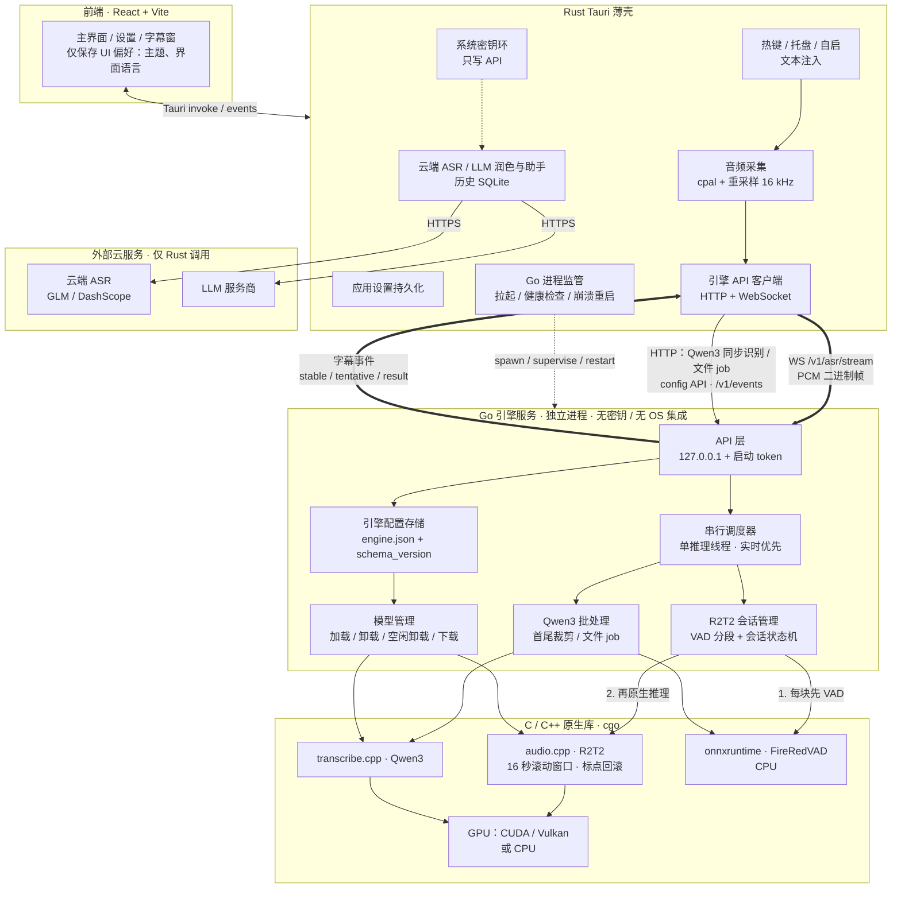
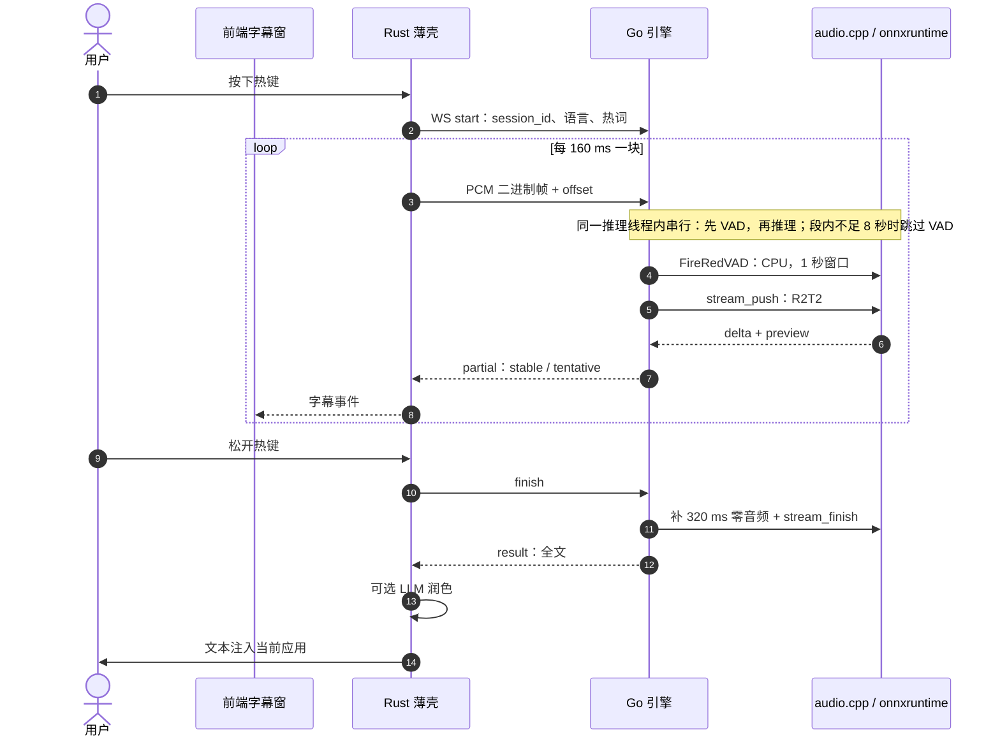

# Command-Cube 规划：前后端分离（Go 引擎后端 + Rust 薄壳 + 独立前端）

> 分支：`Command-Cube`  
> 状态：规划文档（仅描述方向，不包含实现）  
> 基于：对 `main` @ `151a61c` 的只读调研  
> **本文主线**：用独立 Go 后端服务取代 Python 编排层；Rust（Tauri）只做系统集成与应用层；前端独立。

---

## 1. 目标与已定决策

1. **Python 编排层 → 独立 Go 后端服务（引擎）**：以独立进程运行，通过 cgo 调用 C++ 库（R2T2 走 audio.cpp C ABI，Qwen3 走 transcribe.cpp），FireRedVAD 走 onnxruntime；对外提供完整的本地 HTTP + WebSocket API。
2. **双引擎分工保留**：
   - **R2T2（audio.cpp）= 实时模式，有直播字幕**：原生流式 delta 拼接 + preview/committed 状态机 + 标点回滚（C++ 内）。
   - **Qwen3（transcribe.cpp）= 回退 / 非实时模式，无直播字幕**：整段识别；也供文件类工具（歌词、字幕）批处理。
3. **Rust 只经 API 管理后端**：可以拉起 / 监管 / 重启进程，但不再走 stdio JSON，不直接链接推理库。
4. **调度保持串行**：单推理线程顺序调用 C 库，会话内先 VAD 再推理，与现有 Python 语义一致；R2T2 与 Qwen3 之间实时优先排队。
5. **删除 Rust `interim.rs` 的 12 秒窗口伪实时**（Qwen3 不提供直播字幕）。
6. **前端**只与 Rust / API 通信，只保留纯 UI 偏好。
7. 后续功能（非主线）：
   - agent 快捷调用：需自行维护接收端插件，细节后续定。
   - 歌词 / 视频字幕：走 Qwen3 job API + VAD 句级时间，引擎拆分完成后再做。

### 背景与分支理由

上游 [`sypsyp97/light-whisper`](https://github.com/sypsyp97/light-whisper) 定位为热键听写客户端，短期内不会做引擎服务化。本分支的理由：本地转录链路已经很重，应复用已有 C++ 内核并拆成独立服务，而不是推倒换栈。

---

## 2. 现状架构（`main`）

| 层级 | 技术 | 关键路径 |
|------|------|----------|
| 桌面壳 + 前端 | Tauri 2 + React 19 / Vite | `src/`、`src-tauri/tauri.conf.json`、`src/api/tauri.ts` |
| 应用逻辑 | Rust（录音、热键、注入、云 ASR、LLM、历史 SQLite） | `src-tauri/src/services/`、`src-tauri/src/commands/` |
| 本地 ASR 编排 | Python 子进程，stdin/stdout 一行一条 JSON | `src-tauri/src/services/funasr_service.rs`、`funasr_service/protocol.rs`、`resources/server_common.py` |
| Qwen3-ASR 0.6B | Python → `transcribe-cpp` | `resources/qwen3_asr_server.py`、`scripts/build_engine.py` |
| Confucius4-R2T2 | Python ctypes → audio.cpp C ABI | `resources/r2t2_native.py`、`r2t2_stream.py`、`r2t2_segmented.py`、`r2t2_asr_server.py`、`scripts/build_r2t2_runtime.py`、`scripts/patches/audio-cpp-r2t2-windows-streaming.patch` |
| VAD | FireRedVAD ONNX + onnxruntime + kaldi-native-fbank | `resources/firered_vad.py` |
| 发布 | PyInstaller → `engine.exe` → `engine.tar.xz` | `resources/engine.py`、`tauri.conf.json` |

### 2.1 分句 / 切段现状（迁移重点）

| 层 | 位置 | 行为 |
|----|------|------|
| Python | `firered_vad.py` → `speech_timestamps` | 基于静音产出语音区间：阈值 0.5、平滑 5 帧、最短语音 150ms、最短静音 300ms、首尾各补 120ms、重叠合并 |
| Python | `r2t2_segmented.py` → `SegmentedR2T2` | **外层 VAD 分段**：1 秒 VAD 窗口；段长 ≥8 秒且尾部静音 ≥300ms 才结束一段（线上无最大长度强切）；每段重启原生会话；段间 ASCII 补空格拼接 |
| Python | `r2t2_stream.py` → `R2T2StreamSession` | session_id / offset 校验、committed 只增不减、`tentative = preview − committed` |
| Python | `r2t2_native.py` → `NativeRuntime` | 逐 chunk 推送（CUDA 160ms / CPU 320ms）、delta 累加、preview 前缀校验、finish 补 320ms 零音频、ABI 0.4 首段前缀一次解码、出错 reset |
| C++ | audio.cpp + 项目补丁 | 段内 16 秒滚动窗口（前进 8 秒）、committed 只追加、`rollback_punctuation`（**无需移植**，设置选项即可） |
| Python | `qwen3_asr_server.py` → `_filter_speech` | Qwen3 **不分段**，只用 VAD 裁首尾，整段 `run(timestamps="none")` |
| Rust | `audio_service/interim.rs` | Qwen 伪实时：每约 140–460ms 重识别最近 12 秒音频、取最长公共前缀 → **将删除** |
| Rust / 前端 | `native_recording.rs`、`SubtitleOverlay.tsx` | 只转发 / 渲染 stable 与 tentative，不切句 |

**待定**：保留外层「8 秒 + 静音」分段，还是只依赖 C++ 16 秒滚动窗口？**先原样移植**，再用现有 Python 测例（`test_r2t2_segmented.py`、`test_r2t2_stream.py`、`benchmark_r2t2_startup.py` 等）对比 committed 轨迹与最终文本后决定。

### 2.2 设置现状（盘点）

| 设置组 | 现存储 | 现消费方 | 现生效方式 |
|--------|--------|----------|------------|
| 引擎选择 | `engine.json` → `engine` | Python（`--engine`、`LIGHT_WHISPER_ASR_ENGINE`）；云 ASR 走 Rust | `set_engine`：写文件 → 停进程 → 下次识别重启 |
| 模型目录 | `engine.json` → `models_dir` | Python（`HF_HUB_CACHE`）、下载器 | `set_models_dir`：可迁移，**需重启引擎** |
| GPU 空闲卸载 | `engine.json` → `gpu_idle_seconds` | Python（启动 env + JSON `set_gpu_idle`） | **即时** |
| R2T2 语言 / 主题提示 | `user_profile.json` → `r2t2` | 每次 `stream_start` / `transcribe` 下发 | 下一次录音 |
| 热词 / 纠错规则 | `user_profile.json` | 热词随请求下发；纠错规则由 Rust 润色使用 | 下一次请求 |
| 云 ASR 区域 / 模型 / Key | `engine.json` + 系统密钥环 | Rust | 即时 |
| LLM / 润色 / 助手 / 划词 / JEV / 搜索 / 按应用规则 | `user_profile.json` + 密钥环 | Rust | 即时 |
| 历史 | `user_profile.json` → `history_settings`；`transcription_history.sqlite3` | Rust | 即时 |
| 主热键、录音模式、麦克风、输入方式、提示音、电平监测、润色开关 | **仅 localStorage**（`light-whisper-*`） | Rust（启动时由前端推送，Rust 只放内存） | 前端启动推送 |
| 翻译 / 助手热键、启动最小化 | `user_profile.json` / autostart 插件 | Rust | 即时 |
| 主题、UI 语言、引导、草稿 | localStorage | 仅前端 | 即时 |

VAD 阈值、R2T2 chunk、设备（`nvidia-smi` 自动探测）目前**用户不可配**。数据目录：`%APPDATA%\com.light-whisper.app\`。

---

## 3. 目标架构

### 3.0 架构图



### 3.0.1 一次实时听写（R2T2）



### 3.1 职责边界

| 职责 | Go 后端 | Rust 薄壳 | 前端 |
|------|:------:|:--------:|:----:|
| 模型加载 / 卸载、下载、校验 | ✅ | 发起请求 | 显示 |
| 推理调度（实时优先、批处理排队、GPU 争用） | ✅ | — | — |
| FireRedVAD、R2T2 分段与会话状态机 | ✅ | — | — |
| Qwen3 裁剪 + 批处理 / job | ✅ | 提交 job | 文件工具 UI |
| 引擎设置（引擎 / 模型 / 目录 / GPU 空闲 / 设备 / 默认语言） | ✅（持有并持久化） | 代理 | 编辑 |
| 音频采集（cpal）+ 经 WS 推流 | — | ✅ | — |
| 热键 / 托盘 / 自启 / 文本注入 / 前台应用识别 | — | ✅ | — |
| 云 ASR、LLM 润色 / 助手 / 划词、联网搜索 | — | ✅ | — |
| 历史（SQLite）、热词 / 纠错学习、按应用规则 | — | ✅ | — |
| 密钥（API Key / OAuth） | ❌ 不持有 | ✅ 密钥环 | 只写 |
| 应用层设置持久化（含原 localStorage 项） | — | ✅ | 编辑 |
| 主题 / UI 语言 / 引导 / 草稿 | — | — | ✅ |
| 后端进程拉起 / 监管 / 重启 | — | ✅（仅通过 API 交互） | — |

原则：

- 后端**无密钥、无 OS 集成**，可无头运行，可单独测试。
- Rust **只经 API** 使用后端：不链接推理库，不读写后端的配置文件。
- 热词、R2T2 语言 / 主题提示由 Rust **按请求下发**，不作为后端全局状态。
- 前端不直接持有业务设置；开发模式下可直连后端 API 调试。

### 3.2 设置归属（目标）

| 设置 | 归属 | 存储 | 生效 |
|------|------|------|------|
| 引擎 / 模型选择、模型目录、设备偏好 | Go 后端 | 后端 `engine.json`（带 `schema_version`） | **reload**（需重载模型） |
| GPU 空闲卸载、默认语言、日志级别 | Go 后端 | 同上 | **live** |
| VAD / 分段高级参数（可选开放） | Go 后端 | 同上 | live 或下一会话 |
| 热键、录音模式、麦克风、输入方式、提示音、电平监测、润色开关 | Rust | 壳内设置文件（从 localStorage 迁入） | 即时 |
| 云 ASR、LLM、搜索、历史、按应用规则、热词 / 纠错 | Rust | `user_profile.json`（加 `schema_version`） | 即时 |
| 所有密钥 | Rust | 系统密钥环 | 只写 |
| 主题、UI 语言、引导、草稿 | 前端 | localStorage | 即时 |

---

## 4. 后端 API 草案

所有接口只绑 `127.0.0.1`，端口随机（或可配置）。每个请求必须带 `Authorization: Bearer <startup-token>`：后端启动时生成 token，经 stdout 首行或临时文件交给 Rust。

### 4.1 健康与事件

| 方法 / 路径 | 说明 |
|-------------|------|
| `GET /health` | 存活、后端版本、`api_version`（供壳做兼容性检查） |
| `GET /v1/engine/status` | 已加载引擎、device、model_loaded、GPU 信息、缺失模型、调度队列状态 |
| `WS /v1/events` | `engine_status`、`config_changed`、`download_progress`、`job_progress` |

### 4.2 引擎设置（config API）

```text
GET   /v1/config
      → { schema_version, revision, values: {...}, apply: { "<key>": "live" | "reload" } }
GET   /v1/config/schema          → JSON Schema（前端据此生成表单）
PATCH /v1/config                 带 If-Match: <revision>
      → { revision, applied: [...], pending_reload: [...] }
POST  /v1/engine/reload          执行待生效的 reload 项；有实时会话时返回 409
```

### 4.3 模型

| 方法 / 路径 | 说明 |
|-------------|------|
| `GET /v1/models` | 清单、已安装状态、校验结果 |
| `POST /v1/models/{id}/download`、`DELETE /v1/models/{id}/download` | 开始 / 取消下载（进度走 `/v1/events`） |
| `POST /v1/engine/load`、`POST /v1/engine/unload` | 显式加载 / 卸载 |

### 4.4 实时（R2T2 only）— WebSocket

`WS /v1/asr/stream`

- **客户端 → 后端**：`start {session_id, language?, context?, hot_words?}`，随后发送二进制帧（PCM s16le、16 kHz、单声道，帧头携带 offset），最后 `finish` 或 `cancel`。
- **后端 → 客户端**：`partial {committed, tentative}`、`result {text, language, sample_count}`、`error`。
- **约束**：
  - 未加载 R2T2 时拒绝连接（不得静默降级到 Qwen3）。
  - 同一时间只允许一个实时会话（与现状一致）。
  - 音频用二进制帧，不用 base64。
  - **会话内严格串行**：后端按到达顺序逐块处理，每块先 VAD 再原生推理，结束段（补 320ms + `stream_finish`）在该块内同步完成；与现有 Python 语义一致。WS 只是传输通道，帧在后端有界队列中等待，不与推理重叠。

### 4.5 批处理（Qwen3）— HTTP

| 方法 / 路径 | 说明 |
|-------------|------|
| `POST /v1/asr/transcribe` | 短音频同步整段识别（Rust 回退听写用），body 为 PCM 或 WAV |
| `POST /v1/jobs` | 文件转录 job（路径或上传），可选 `segments: true`（句级时间来自 VAD） |
| `GET /v1/jobs/{id}`、`DELETE /v1/jobs/{id}` | 查询 / 取消 |

两引擎**都不原生输出时间戳**（transcribe.cpp 为 `TIMESTAMPS_NONE`；R2T2 只输出文本 delta）。句级时间 = VAD 分段边界；词级需后续接入对齐器（如 Qwen3-ForcedAligner）。

### 4.6 调度策略（串行）

- **单推理线程**：所有对 C 库的调用（audio.cpp、transcribe.cpp、onnxruntime VAD）都在一个固定的推理线程上顺序执行（`LockOSThread`），与现有 Python 单线程语义一致。
- **会话内串行**：R2T2 每块先 VAD（CPU）再原生推理，结束段在块内同步完成；Qwen3 先 VAD 裁剪再整段识别。**不做 VAD 与推理并行，不做流水线。**
- **实时优先排队**：R2T2 实时会话与 Qwen3 job 共用同一个推理线程。实时会话进行时 job 排队等待；job 按 VAD 段逐段执行，段与段之间让出给实时会话。单段执行中途是否可取消，取决于 transcribe.cpp 的取消接口（待核实），否则等该段结束。
- **非推理请求不进推理线程**：status、config、events、下载进度由独立的 goroutine 处理，不排在推理后面。
- GPU 空闲卸载只在没有实时会话、job 队列为空时触发；重新加载时预热一次。队列长度与等待时间通过 status / events 暴露。

> **未采纳 / 后续可选**：段内 VAD（CPU）与原生推理（GPU）并行、后端在推理当前块时预处理后续块（流水线）、文件 job 的 VAD 与识别流水线、Qwen3 在实时会话期间降级到 CPU 并行运行。这些需要先有串行版本的回归基线，本阶段不做。

---

## 5. 前后端分离难点评估

严重度：🔴 高 / 🟠 中 / 🟢 低。

| # | 难点 | 严重度 | 说明 | 缓解 |
|---|------|:------:|------|------|
| 1 | **R2T2 分段 / 会话逻辑忠实移植** | 🔴 | 需要逐项对齐 `SegmentedR2T2` / `R2T2StreamSession` / `NativeRuntime` 的细节：offset 校验、committed 只增不减、preview 前缀校验、finish 补 320ms 零音频、ABI 0.4 首段前缀一次解码、chunk 160/320ms、每段重启原生会话、段间补空格、出错 reset。语义稍有偏差就会出现丢句尾或字幕回退 | 把 Python 测例改写为 Go 表驱动测试；用同一批 PCM 夹具对比 Python 与 Go 的 committed 轨迹和最终文本，逐字一致才算通过；分段策略的取舍放到之后 |
| 2 | **Windows 上的 cgo 与原生依赖打包** | 🔴 | Go cgo 在 Windows 上需要 MinGW gcc；而 audio.cpp / transcribe.cpp 的 CUDA 构建基于 MSVC（CUDA 12.9、MSVC 14.44）。走纯 C ABI 一般可行，但不能跨 ABI 传 C++ 对象或 CRT 资源；还要打包 CUDA / CRT DLL，以及 CPU、Vulkan、CUDA 多种变体 | 只经 C ABI 调用，按需 `LoadLibrary` 动态加载（cgo 或 `syscall`/purego 风格）；内存由库自己分配和释放；沿用 `build_r2t2_runtime.py` / `build_engine.py` 的 manifest 与 SHA-256 校验；transcribe.cpp 需确认有稳定的 C 头文件，必要时写一层薄 C 封装 |
| 3 | **进程生命周期与版本兼容** | 🟠 | Rust 需要拉起和监管后端、崩溃后重启、交接端口与 token、处理壳与后端版本不匹配、处理实时会话中途后端崩溃（现有 `ipc_recovery_tests.rs` 的语义） | `/health` 返回 `api_version`，Rust 校验兼容范围；用 Job Object 绑定子进程生命周期；指数退避重启；会话中断时向 UI 发明确错误，并保留已 committed 的文本 |
| 4 | **性能** | 🟠 | ①本地 WS 推流：160ms 一帧，回环延迟通常小于 1ms，不是瓶颈，但要避免 base64 和 JSON 封装；②cgo 每次调用约 50–100ns，可忽略；但单次 `stream_push` / `run` 是长时间 C 调用，会占住 OS 线程；③缓冲区复用与 GC 抖动；④实时与批处理争用唯一的推理线程 / GPU；⑤冷启动、模型加载、空闲卸载后的预热（现状初始化约 5 秒） | 二进制帧；单一推理线程 `LockOSThread`，会话内串行；用 `sync.Pool` 复用 PCM 缓冲，传给 C 的内存固定或由 C 侧分配；按 §4.6 实时优先调度；模型加载后预热并报告 ready；空闲卸载阈值可配，重新加载时 UI 显示加载状态 |
| 5 | **FireRedVAD 移植** | 🟠 | 关键在 fbank 特征一致性：`kaldi-native-fbank` 是 C++，Go 端要么用 C 封装调用它，要么用 Go 重写（帧长、窗函数、mel、CMVN 都要逐项一致）；onnxruntime 可用 `onnxruntime_go`（cgo 动态加载） | 优先封装原 C++ fbank 库保证一致；与 Python 输出逐帧对比概率（误差 < 1e-4）和区间 |
| 6 | **协议 / 契约迁移（含 `formal/`）** | 🟠 | stdio JSON 改为 HTTP/WS；`protocol.rs`、`ipc_dto_contract_tests.rs`，以及 `formal/` 下 TLA+（EngineSpeech、GpuIdle、EngineDownload 等）都以现有 IPC 为前提 | 先冻结契约（OpenAPI + WS 消息 schema），用契约测试双向校验；逐个更新 `.tla`，暂缓的在 `formal/COVERAGE.md` 标注 |
| 7 | **设置迁移** | 🟠 | localStorage 设置迁到壳内持久化；`engine.json` 归后端所有；`user_profile.json` 加 `schema_version`；首次升级要一次性搬迁，失败可回退 | 前端首启时读取 localStorage，通过一次性迁移命令写入壳；后端读取旧 `engine.json` 并升级 schema；迁移幂等且有日志 |
| 8 | **三语言工具链与 CI 成本** | 🟠 | Rust（需 ≥1.87/1.88，现有依赖 `time`、`zbus` 已要求）+ Go（含 cgo/MinGW）+ C++（MSVC/CUDA/CMake/Ninja）；CUDA 构建耗时长 | `rust-toolchain.toml` 钉版本；原生库预构建成制品并缓存；CI 分层：Go 单测用 mock 推理，原生集成测试放夜间或手动 |
| 9 | **本地 API 安全** | 🟢 | 同机其他进程或网页可能访问回环端口 | 只绑 `127.0.0.1`；随机 token 必带；校验 `Origin`、拒绝浏览器跨域；不加 CORS 通配；后端不持有任何密钥 |
| 10 | **删除 `interim.rs` 的产品影响** | 🟢 | Qwen3 模式失去伪实时字幕 | 已是既定决策；UI 在 Qwen3 模式明确显示「无实时字幕」 |

**难度排序（由难到易）**：R2T2 会话 / 分段移植 ≈ Windows cgo 与原生打包 > 进程生命周期与版本兼容 > FireRedVAD fbank 一致性 > 性能（串行调度下的排队与长 C 调用）> 协议与 `formal/` 迁移 > 设置迁移 > 工具链 / CI > 本地 API 安全 > 删除 interim。

---

## 6. 迁移步骤与完成标准

### 步骤 0：契约冻结

- 产出 OpenAPI（HTTP）+ WS 消息 schema（实时会话、事件），以及 config schema v1。
- 把现有 stdio JSON 语义（`ServerCommand` / `ServerResponse`）映射到新 API，形成对照表。
- **完成标准**：契约文档合入；Rust 侧 mock 服务按契约跑通「有字幕（R2T2）/ 无字幕（Qwen3）」两条 UI 流程。

### 步骤 1：Go 后端骨架 + config API

- 进程启动、端口与 token 交接、`/health`、`/v1/engine/status`、`/v1/events`、`GET/PATCH /v1/config`、`/v1/config/schema`、`/v1/engine/reload`；推理部分用 mock。
- **完成标准**：无头启动；Rust 能拉起、校验版本、读写引擎设置；`revision` 冲突返回 412；live 与 reload 标记生效。

### 步骤 2：FireRedVAD（Go + onnxruntime）

- 移植 fbank、CMVN、ONNX 推理与区间后处理。
- **完成标准**：同一批夹具上逐帧概率与区间和 Python 一致（容差内）；无 Python 依赖。

### 步骤 3：R2T2 会话与分段（cgo → audio.cpp）

- 原样移植 `NativeRuntime` / `SegmentedR2T2` / `R2T2StreamSession`（含串行的「先 VAD 再推理、块内结束段」顺序），暴露 `WS /v1/asr/stream`。
- **完成标准**：同一批 PCM 夹具与 Python 的 committed 轨迹和最终文本逐字一致；首字幕延迟不劣于 `docs/r2t2-native.md` 中的基线；取消 / 错误 / 重启语义通过；之后再评估是否保留 8 秒 + 静音外层分段。

### 步骤 4：Qwen3 批处理（cgo → transcribe.cpp）+ 调度

- 首尾裁剪 + 整段识别；`POST /v1/asr/transcribe`、`/v1/jobs`；单推理线程上的实时优先排队（job 按段让出）、GPU 空闲卸载、预热。
- **完成标准**：Qwen3 识别结果与 Python 一致；实时会话进行中提交 job 只排队、不影响实时延迟（有压测数据）；会话内处理顺序与 Python 一致（串行）；空闲卸载后再次加载可用。

### 步骤 5：Rust 切换，移除 Python / PyInstaller

- Rust 用 HTTP/WS 客户端取代 stdio JSON；cpal 音频经 WS 推流；删除 `interim.rs`；密钥 API 改为只写；localStorage 设置迁入壳内；打包改为 Go 后端 + 原生 DLL。
- **完成标准**：安装包不再包含 Python 和 `engine.tar.xz`；现有听写、热键、注入、润色、历史回归通过；`formal/` 已更新或在 `COVERAGE.md` 标注；崩溃重启与版本不匹配有测试覆盖。

### 步骤 6：独立前端

- 前端可单独 `pnpm dev`；业务设置经 Rust（开发模式可直连后端）；两种模式 UI 分离。
- **完成标准**：前端不再依赖 localStorage 中的业务设置；不打开 Tauri 窗口也能用后端完成引擎设置与文件转录调试。

### 步骤 7：后续工具（低优先级，非拆分门槛）

- 歌词 LRC / 视频字幕 SRT/VTT（Qwen3 job + VAD 句级时间，伴奏可能需要人声分离）；agent 占位能力。

---

## 7. 风险与待定问题

| 风险 / 待定 | 说明 |
|-------------|------|
| 外层分段取舍 | 保留 8 秒 + 静音分段，还是只用 C++ 16 秒滚动窗口？原样移植后用测例对比决定 |
| transcribe.cpp C 接口稳定性 | 需确认公开 C ABI 是否覆盖所需功能（会话、取消、能力查询） |
| CUDA 变体与显存 | 两套原生库与模型同时驻留的显存成本；CPU、Vulkan、CUDA 回退顺序 |
| 上游合并 | 引擎边界大改，cherry-pick 上游的成本上升；尽量保持听写产品行为兼容 |
| Rust 工具链 | 调研环境 `rustc 1.85.1` 无法 `cargo check`；需钉 ≥1.88 |
| 时间戳精度 | 文件工具只有句级时间；词级需对齐器 |

---

## 8. 非目标（本阶段）

- 设计 agent 接收端插件协议或内置 Agent 运行时。
- 实现歌词 / 字幕完整产品流程。
- 用 Qwen3 伪流式替代 R2T2 实时路径。
- 后端持有密钥或做 OS 集成。
- 重写为 Electron / 纯 C++ GUI；强制换成 whisper.cpp。
- 变更 GPL-3.0-only。

---

## 9. 参考路径速查

```text
docs/command-cube/PLAN.md                         ← 本文件
docs/r2t2-native.md                               ← R2T2 流式 / commit 语义与延迟基线
docs/development.md
src-tauri/src/services/funasr_service.rs          ← 现 Python 进程管理（将改为 API 客户端）
src-tauri/src/services/funasr_service/protocol.rs ← 现 stdio JSON 契约
src-tauri/src/services/audio_service/interim.rs   ← 将删除
src-tauri/src/services/audio_service/native_recording.rs
src-tauri/src/services/audio_service/native_capture.rs
src-tauri/src/utils/paths.rs                      ← engine.json 读写
src-tauri/src/state/user_profile.rs
src-tauri/src/services/profile_service.rs         ← user_profile.json
src/lib/constants.ts                              ← localStorage 键
src/contexts/RecordingContext.tsx                 ← 启动推送设置
src-tauri/resources/r2t2_native.py
src-tauri/resources/r2t2_stream.py
src-tauri/resources/r2t2_segmented.py
src-tauri/resources/r2t2_asr_server.py
src-tauri/resources/qwen3_asr_server.py
src-tauri/resources/firered_vad.py
scripts/build_engine.py
scripts/build_r2t2_runtime.py
scripts/patches/audio-cpp-r2t2-windows-streaming.patch
formal/
```
