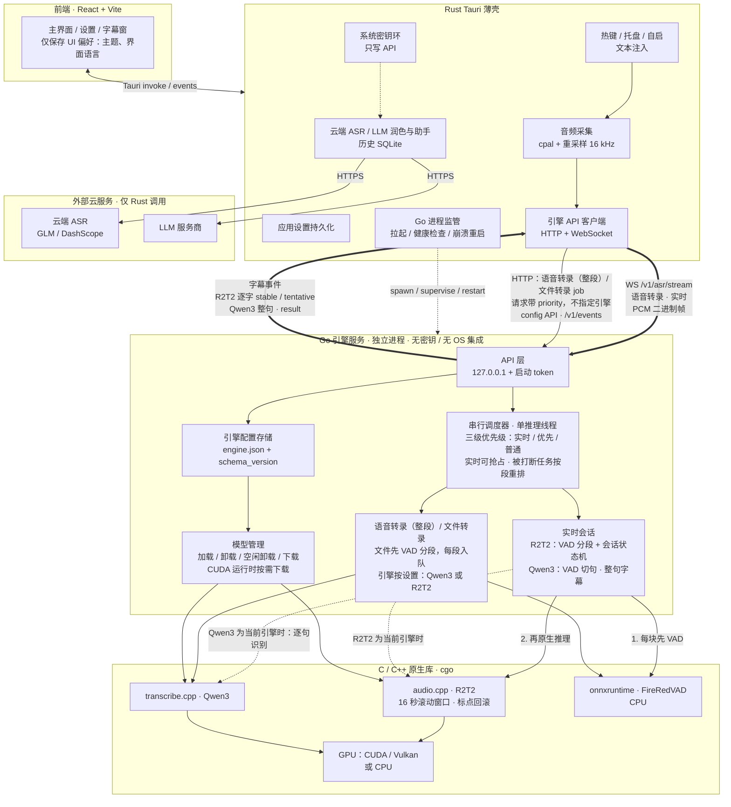
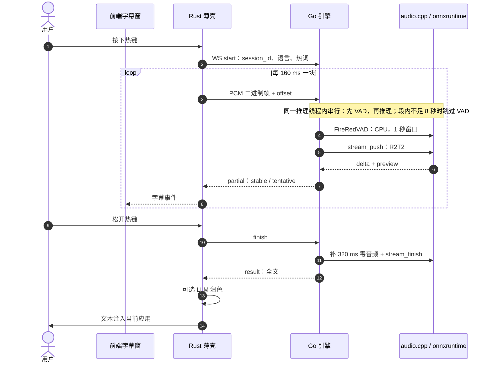
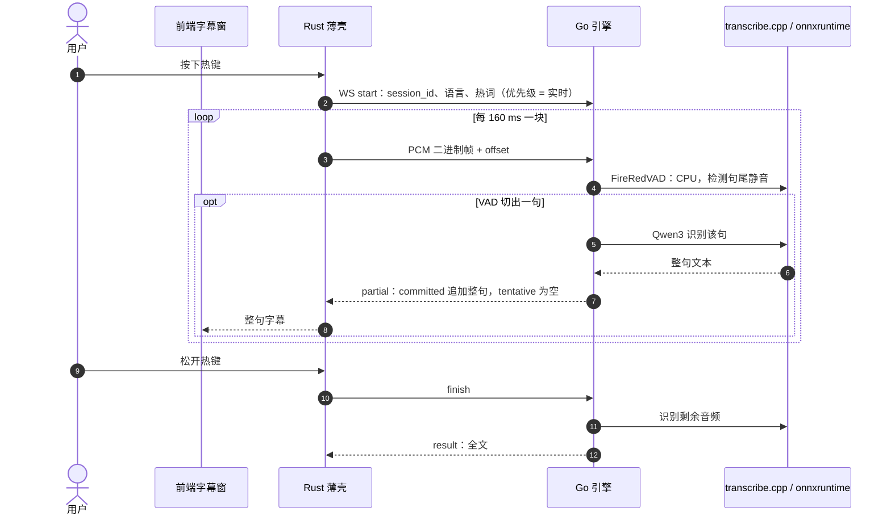
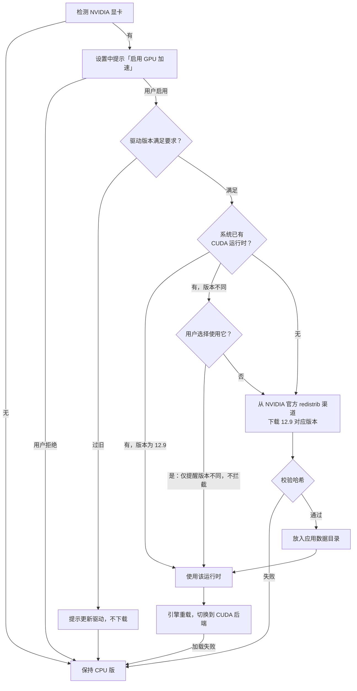

# Command-Cube 规划：前后端分离（Go 引擎后端 + Rust 薄壳 + 独立前端）

> 分支：`Command-Cube`  
> 状态：规划文档；实施进度见 §7 各步骤的「进度」（步骤 1 已完成；步骤 2 FireRedVAD 的 Go 移植已完成并与 Python 对齐；步骤 3 R2T2 会话与分段已移植，在 Linux CPU 上与 Python 逐调用、逐字一致，Windows / CUDA 与延迟基线未实测；Qwen3 推理仍为 mock）  
> 基于：对 `main` @ `151a61c` 的只读调研  
> **本文主线**：用独立 Go 后端服务取代 Python 编排层；Rust（Tauri）只做系统集成与应用层；前端独立。

---

## 1. 目标与已定决策

1. **Python 编排层 → 独立 Go 后端服务（引擎）**：以独立进程运行，通过 cgo 调用 C++ 库（R2T2 走 audio.cpp C ABI，Qwen3 走 transcribe.cpp），FireRedVAD 走 onnxruntime；对外提供完整的本地 HTTP + WebSocket API。
2. **双引擎分工保留**（用哪个引擎由后端按设置决定，前端 / Rust 不指定，见第 4 条）：
   - **R2T2（audio.cpp）= 原生流式实时引擎，有逐字直播字幕**：原生流式 delta 拼接 + preview/committed 状态机 + 标点回滚（C++ 内）；也支持整段识别（批处理），与现 Python R2T2 服务一致。
   - **Qwen3（transcribe.cpp）= 无原生流式，但不限于文件转录**：实时听写时由 VAD 切句，每切出一句识别一次，以**整句字幕**显示（没有逐字 delta）；也做整段语音转录与文件转录（歌词、字幕等），是非实时场景的推荐 / 回退选择。Qwen3 整句实时为**已定设计，在步骤 4 实现**（见 §3.0.2、§4.4）。
3. **Rust 只经 API 管理后端**：可以拉起 / 监管 / 重启进程，但不再走 stdio JSON，不直接链接推理库。
4. **请求模型与调度**：
   - **两类请求**：前端 / Rust 只发**语音转录**和**文件转录**两类请求，每个请求带优先级；由后端按设置决定用哪个引擎。
   - **三级优先级（已定设计，在步骤 4 实现）**：**实时**（实时听写，可抢占）/ **优先**（普通按键听写的默认）/ **普通**（文件转录的默认）。默认值后续开放为用户设置。
   - **调度保持串行**：单推理线程顺序调用 C 库，会话内先 VAD 再推理，与现有 Python 语义一致；后端按优先级排队。实时请求到来时，打断并丢弃正在运行的任务，立即执行实时任务；被打断的任务从中断的那一段重新排队（不判失败），有 VAD 分段时损失至多一段。详见 §4.6。
   - 步骤 1 的现有实现只有「实时 / 批处理」两级，运行中的任务不打断（见 §4.6「与现有实现的关系」）。
5. **删除 Rust `interim.rs` 的 12 秒窗口伪实时**：Qwen3 的实时改为后端 VAD 整句字幕（见第 2 条），不再由壳端反复重识别最近 12 秒。
6. **前端**只与 Rust / API 通信，只保留纯 UI 偏好。
7. 后续功能（非主线）：
   - agent 快捷调用：需自行维护接收端插件，细节后续定。
   - 歌词 / 视频字幕：走文件转录 job（VAD 分段 + 句级时间，推荐 Qwen3），引擎拆分完成后再做。
8. **CUDA 运行时按需下载**：安装包只含 CPU 版，不捆绑 CUDA 运行时；有 NVIDIA 显卡的用户在设置中一键启用，由 Go 引擎检测、下载、校验并切换（见 §5）。
9. **许可证**：新写代码采用 AGPL-3.0-only，继承 / 修改的上游代码保持 GPL-3.0-only（见 §10）。

### 背景与分支理由

上游 [`sypsyp97/light-whisper`](https://github.com/sypsyp97/light-whisper) 定位为热键听写客户端，短期内不会做引擎服务化。本分支的理由：本地转录链路已经很重，应复用已有 C++ 内核并拆成独立服务，而不是推倒换栈。

---

## 2. 现状架构（`main`）

| 层级 | 技术 | 关键路径 |
|------|------|----------|
| 桌面壳 + 前端 | Tauri 2 + React 19 / Vite | `src/`、`src-tauri/tauri.conf.json`、`src/api/tauri.ts` |
| 应用逻辑 | Rust（录音、热键、注入、云 ASR、LLM、历史 SQLite） | `src-tauri/src/services/`、`src-tauri/src/commands/` |
| 本地 ASR 编排 | Python 子进程，stdin/stdout 一行一条 JSON | `src-tauri/src/services/funasr_service.rs`、`funasr_service/protocol.rs`、`resources/server_common.py` |
| Qwen3-ASR 0.6B | Python → `transcribe-cpp` | `resources/qwen3_asr_server.py`、`scripts/build_engine.py` |
| Confucius4-R2T2 | Python ctypes → audio.cpp C ABI | `resources/r2t2_native.py`、`r2t2_stream.py`、`r2t2_segmented.py`、`r2t2_asr_server.py`、`scripts/build_r2t2_runtime.py`、`scripts/patches/audio-cpp-r2t2-windows-streaming.patch` |
| VAD | FireRedVAD ONNX + onnxruntime + kaldi-native-fbank | `resources/firered_vad.py` |
| 发布 | PyInstaller → `engine.exe` → `engine.tar.xz` | `resources/engine.py`、`tauri.conf.json` |

### 2.1 分句 / 切段现状（迁移重点）

| 层 | 位置 | 行为 |
|----|------|------|
| Python | `firered_vad.py` → `speech_timestamps` | 基于静音产出语音区间：阈值 0.5、平滑 5 帧、最短语音 150ms、最短静音 300ms、首尾各补 120ms、重叠合并 |
| Python | `r2t2_segmented.py` → `SegmentedR2T2` | **外层 VAD 分段**：1 秒 VAD 窗口；段长 ≥8 秒且尾部静音 ≥300ms 才结束一段（线上无最大长度强切）；每段重启原生会话；段间 ASCII 补空格拼接 |
| Python | `r2t2_stream.py` → `R2T2StreamSession` | session_id / offset 校验、committed 只增不减、`tentative = preview − committed` |
| Python | `r2t2_native.py` → `NativeRuntime` | 逐 chunk 推送（CUDA 160ms / CPU 320ms）、delta 累加、preview 前缀校验、finish 补 320ms 零音频、ABI 0.4 首段前缀一次解码、出错 reset |
| C++ | audio.cpp + 项目补丁 | 段内 16 秒滚动窗口（前进 8 秒）、committed 只追加、`rollback_punctuation`（**无需移植**，设置选项即可） |
| Python | `qwen3_asr_server.py` → `_filter_speech` | Qwen3 **不分段**，只用 VAD 裁首尾，整段 `run(timestamps="none")` |
| Rust | `audio_service/interim.rs` | Qwen 伪实时：每约 140–460ms 重识别最近 12 秒音频、取最长公共前缀 → **将删除** |
| Rust / 前端 | `native_recording.rs`、`SubtitleOverlay.tsx` | 只转发 / 渲染 stable 与 tentative，不切句 |

**待定**：保留外层「8 秒 + 静音」分段，还是只依赖 C++ 16 秒滚动窗口？**先原样移植**，再用现有 Python 测例（`test_r2t2_segmented.py`、`test_r2t2_stream.py`、`benchmark_r2t2_startup.py` 等）对比 committed 轨迹与最终文本后决定。

### 2.2 设置现状（盘点）

| 设置组 | 现存储 | 现消费方 | 现生效方式 |
|--------|--------|----------|------------|
| 引擎选择 | `engine.json` → `engine` | Python（`--engine`、`LIGHT_WHISPER_ASR_ENGINE`）；云 ASR 走 Rust | `set_engine`：写文件 → 停进程 → 下次识别重启 |
| 模型目录 | `engine.json` → `models_dir` | Python（`HF_HUB_CACHE`）、下载器 | `set_models_dir`：可迁移，**需重启引擎** |
| GPU 空闲卸载 | `engine.json` → `gpu_idle_seconds` | Python（启动 env + JSON `set_gpu_idle`） | **即时** |
| R2T2 语言 / 主题提示 | `user_profile.json` → `r2t2` | 每次 `stream_start` / `transcribe` 下发 | 下一次录音 |
| 热词 / 纠错规则 | `user_profile.json` | 热词随请求下发；纠错规则由 Rust 润色使用 | 下一次请求 |
| 云 ASR 区域 / 模型 / Key | `engine.json` + 系统密钥环 | Rust | 即时 |
| LLM / 润色 / 助手 / 划词 / JEV / 搜索 / 按应用规则 | `user_profile.json` + 密钥环 | Rust | 即时 |
| 历史 | `user_profile.json` → `history_settings`；`transcription_history.sqlite3` | Rust | 即时 |
| 主热键、录音模式、麦克风、输入方式、提示音、电平监测、润色开关 | **仅 localStorage**（`light-whisper-*`） | Rust（启动时由前端推送，Rust 只放内存） | 前端启动推送 |
| 翻译 / 助手热键、启动最小化 | `user_profile.json` / autostart 插件 | Rust | 即时 |
| 主题、UI 语言、引导、草稿 | localStorage | 仅前端 | 即时 |

VAD 阈值、R2T2 chunk、设备（`nvidia-smi` 自动探测）目前**用户不可配**。数据目录：`%APPDATA%\com.light-whisper.app\`。

---

## 3. 目标架构

### 3.0 架构图



### 3.0.1 一次实时听写（R2T2）



### 3.0.2 一次 Qwen3 整句实时听写（已定设计，步骤 4 实现）

Qwen3 没有原生流式。实时听写时后端用 VAD 切句，每切出一句识别一次，字幕以整句为单位出现（没有逐字 delta）。端点与 R2T2 相同，模式由当前引擎决定，壳端不区分。



### 3.1 职责边界

| 职责 | Go 后端 | Rust 薄壳 | 前端 |
|------|:------:|:--------:|:----:|
| 模型加载 / 卸载、下载、校验 | ✅ | 发起请求 | 显示 |
| CUDA 运行时检测 / 下载 / 校验 / 加载（见 §5） | ✅ | 转发 API | 按钮与进度 |
| 推理调度（三级优先级排队、实时抢占与按段重排、GPU 争用） | ✅ | — | — |
| 按设置选择引擎（请求不指定引擎） | ✅ | — | — |
| FireRedVAD、R2T2 分段与会话状态机、Qwen3 VAD 整句实时 | ✅ | — | — |
| 语音转录（整段）/ 文件转录 job（文件先 VAD 分段、按段入队） | ✅ | 提交请求（带优先级） | 文件工具 UI |
| 引擎设置（引擎 / 模型 / 目录 / GPU 空闲 / 设备 / 默认语言） | ✅（持有并持久化） | 代理 | 编辑 |
| 音频采集（cpal）+ 经 WS 推流 | — | ✅ | — |
| 热键 / 托盘 / 自启 / 文本注入 / 前台应用识别 | — | ✅ | — |
| 云 ASR、LLM 润色 / 助手 / 划词、联网搜索 | — | ✅ | — |
| 历史（SQLite）、热词 / 纠错学习、按应用规则 | — | ✅ | — |
| 密钥（API Key / OAuth） | ❌ 不持有 | ✅ 密钥环 | 只写 |
| 应用层设置持久化（含原 localStorage 项） | — | ✅ | 编辑 |
| 主题 / UI 语言 / 引导 / 草稿 | — | — | ✅ |
| 后端进程拉起 / 监管 / 重启 | — | ✅（仅通过 API 交互） | — |

原则：

- 后端**无密钥、无 OS 集成**，可无头运行，可单独测试。
- Rust **只经 API** 使用后端：不链接推理库，不读写后端的配置文件。
- 前端 / Rust 只提交**语音转录**、**文件转录**两类请求并带优先级，**不选择引擎**；引擎由后端按设置决定。
- 热词、R2T2 语言 / 主题提示由 Rust **按请求下发**，不作为后端全局状态。
- 前端不直接持有业务设置；开发模式下可直连后端 API 调试。

### 3.2 设置归属（目标）

| 设置 | 归属 | 存储 | 生效 |
|------|------|------|------|
| 引擎 / 模型选择、模型目录、设备偏好 | Go 后端 | 后端 `engine.json`（带 `schema_version`） | **reload**（需重载模型） |
| GPU 空闲卸载、默认语言、日志级别 | Go 后端 | 同上 | **live** |
| VAD / 分段高级参数（可选开放） | Go 后端 | 同上 | live 或下一会话 |
| 默认优先级（语音转录默认「优先」、文件转录默认「普通」；后续开放） | Go 后端 | 同上（新增键，步骤 4） | live（对之后提交的请求生效） |
| 热键、录音模式、麦克风、输入方式、提示音、电平监测、润色开关 | Rust | 壳内设置文件（从 localStorage 迁入） | 即时 |
| 云 ASR、LLM、搜索、历史、按应用规则、热词 / 纠错 | Rust | `user_profile.json`（加 `schema_version`） | 即时 |
| 所有密钥 | Rust | 系统密钥环 | 只写 |
| 主题、UI 语言、引导、草稿 | 前端 | localStorage | 即时 |

---

## 4. 后端 API 草案

所有接口只绑 `127.0.0.1`，端口随机（或可配置）。每个请求必须带 `Authorization: Bearer <startup-token>`：后端启动时生成 token，经 stdout 首行或临时文件交给 Rust。

### 4.1 健康与事件

| 方法 / 路径 | 说明 |
|-------------|------|
| `GET /health` | 存活、后端版本、`api_version`（供壳做兼容性检查） |
| `GET /v1/engine/status` | 已加载引擎、device、model_loaded、GPU 信息、缺失模型、调度队列状态（步骤 4 起按优先级分别计数） |
| `WS /v1/events` | `engine_status`、`config_changed`、`download_progress`、`job_progress` |

### 4.2 引擎设置（config API）

```text
GET   /v1/config
      → { schema_version, revision, values: {...}, apply: { "<key>": "live" | "reload" } }
GET   /v1/config/schema          → JSON Schema（前端据此生成表单）
PATCH /v1/config                 带 If-Match: <revision>
      → { revision, applied: [...], pending_reload: [...] }
POST  /v1/engine/reload          执行待生效的 reload 项；有实时会话时返回 409
```

### 4.3 模型

| 方法 / 路径 | 说明 |
|-------------|------|
| `GET /v1/models` | 清单、已安装状态、校验结果 |
| `POST /v1/models/{id}/download`、`DELETE /v1/models/{id}/download` | 开始 / 取消下载（进度走 `/v1/events`） |
| `POST /v1/engine/load`、`POST /v1/engine/unload` | 显式加载 / 卸载 |
| `GET /v1/runtimes/cuda`、`POST /v1/runtimes/cuda/download`、`DELETE /v1/runtimes/cuda/download` | CUDA 运行时状态 / 开始 / 取消下载（见 §5） |

### 4.4 语音转录 · 实时 — WebSocket

`WS /v1/asr/stream`

- **客户端 → 后端**：`start {session_id, language?, context?, hot_words?}`，随后发送二进制帧（PCM s16le、16 kHz、单声道，帧头携带 offset），最后 `finish` 或 `cancel`。
- **后端 → 客户端**：`partial {committed, tentative}`、`result {text, language, sample_count}`、`error`。
- **约束**：
  - 实时会话的优先级固定为**实时**（`realtime`，见 §4.6）。
  - 模式由当前引擎决定，**不静默更换引擎**：R2T2 走原生流式（逐字 `committed` / `tentative`）；Qwen3 走 VAD 整句模式（每切出一句识别一次，`committed` 追加整句，`tentative` 为空，见 §3.0.2）；云端引擎返回 409。Qwen3 整句模式是**已定设计，在步骤 4 实现**；在此之前，现有实现对非 R2T2 的引擎返回 409 `wrong_engine`。
  - 同一时间只允许一个实时会话（与现状一致）。
  - 音频用二进制帧，不用 base64。
  - **会话内严格串行**：后端按到达顺序逐块处理，每块先 VAD 再原生推理，结束段（补 320ms + `stream_finish`）在该块内同步完成；与现有 Python 语义一致。WS 只是传输通道，帧在后端有界队列中等待，不与推理重叠。

### 4.5 语音转录（整段）与文件转录 — HTTP

| 方法 / 路径 | 说明 |
|-------------|------|
| `POST /v1/asr/transcribe` | **语音转录（整段）**：短音频同步识别（普通按键听写、回退用），引擎由设置决定（Qwen3 或 R2T2），body 为 PCM 或 WAV。可带 `priority`，缺省为**优先**（`high`）；`priority` 参数是已定设计，在步骤 4 实现，现有实现一律按批处理级排队 |
| `POST /v1/jobs` | **文件转录** job（路径或上传），缺省优先级为**普通**（`normal`）；可选 `segments: true`（句级时间来自 VAD） |
| `GET /v1/jobs/{id}`、`DELETE /v1/jobs/{id}` | 查询 / 取消 |

- **两种引擎都可做批处理**：Qwen3 用 VAD 裁首尾后整段识别；R2T2 把整段音频按块送入新建的分段会话再结束（与现 Python `r2t2_asr_server.py` 的 `transcribe_audio` 一致）。非实时听写与小工具（文件转录、歌词 / 字幕）仍**推荐 Qwen3**，它也是回退选择；配置为云端引擎时返回 409。
- **R2T2 整段识别与实时会话（现行规则，保留）**：两者共用唯一的推理线程和同一个已加载的 R2T2 模型。实时会话进行中提交 R2T2 整段识别直接返回 409（与 Python 的 `stream_busy` 一致）；R2T2 整段识别作为一个未分段的整体任务执行，执行期间开始的实时会话要等它结束。Qwen3 整段识别照常排在实时会话之后（见 §4.6）。三级优先级实现后，这条 409 规则只适用于当前这条**未分段的整段路径**；到步骤 4 再评估：如果整段音频也先经 VAD 分段、按段入队，就可以改为排队、被抢占后按段重排，不再返回 409。
- **大文件转录（已定设计，在步骤 4 实现）**：Rust 把文件 job 交给 Go；Go 先用 VAD 分段，再把每一段作为一个任务按该 job 的优先级送入模型队列。实时请求可以在段与段之间插入，或打断当前段（被打断的段连同其后各段重新排队）。这也解决了此前「R2T2 长文件 job 能否按段让出给实时会话」的待定项：两种引擎的文件 job 都按段入队、按段让出。

两引擎**都不原生输出时间戳**（transcribe.cpp 为 `TIMESTAMPS_NONE`；R2T2 只输出文本 delta）。句级时间 = VAD 分段边界；词级需后续接入对齐器（如 Qwen3-ForcedAligner）。

### 4.6 调度策略（串行 · 三级优先级）

- **单推理线程**：所有对 C 库的调用（audio.cpp、transcribe.cpp、onnxruntime VAD）都在一个固定的推理线程上顺序执行（`LockOSThread`），与现有 Python 单线程语义一致。
- **会话内串行**：R2T2 每块先 VAD（CPU）再原生推理，结束段在块内同步完成；Qwen3 整段识别先 VAD 裁剪再识别；Qwen3 实时先 VAD 切句再逐句识别；文件转录先 VAD 分段再逐段识别。**不做 VAD 与推理并行，不做流水线。**
- **请求与优先级（已定设计，在步骤 4 实现）**：请求只分语音转录、文件转录两类，各带一个优先级；引擎由后端按设置选择。

  | 优先级 | API 取值 | 用途 / 默认 | 调度行为 |
  |--------|----------|-------------|----------|
  | 实时 | `realtime` | 实时听写（`WS /v1/asr/stream`，固定为此级） | 最高；到来时打断并丢弃正在运行的任务，立即执行 |
  | 优先 | `high` | 普通按键听写（`POST /v1/asr/transcribe` 的缺省值） | 排在实时之后、普通之前；不抢占 |
  | 普通 | `normal` | 文件转录（`POST /v1/jobs` 的缺省值） | 最低；不抢占 |

  - API 字段统一叫 `priority`，取值 `realtime` / `high` / `normal`，分别对应 **实时 / 优先 / 普通**；沿用契约里小写英文枚举的写法（如 `apply: live | reload`），文档和 UI 用中文名。
  - 默认值（语音转录 = 优先，文件转录 = 普通）后续开放为用户设置（§3.2）；请求显式给出的 `priority` 优先于默认值。
  - 同级按提交顺序（FIFO）。只有**实时**会抢占；**优先**与**普通**之间只按队列顺序，不打断正在运行的任务。
- **抢占与按段重排（已定设计，在步骤 4 实现）**：
  - 实时请求到来时，正在运行的非实时任务被打断，当前段的结果丢弃，推理线程立即转去执行实时任务。
  - 被打断的任务**不判失败**，而是从中断的那一段重新排队，保持原优先级（排在同级队首，避免被同级后来者插队）。
  - 有 VAD 分段时，损失至多一段（被丢弃的那一段重新识别）；大文件 job 与 Qwen3 整句识别本身就按段执行。
  - 能否在单段的 C 调用中途立即中止，取决于 transcribe.cpp / audio.cpp 的取消接口（待核实，见 §8）；不能中止时退化为当前段结束后立即让出，实时请求最多等待一段的推理时间。
- **与现有实现的关系**：
  - 步骤 1 的 Go 调度器只有两级（`Realtime` / `Batch`），运行中的任务不打断（run-to-completion）。本文此前「运行中的任务不抢占」的描述对应这个两级实现，「job 段与段之间让出」是当时的过渡设想；步骤 4 实现三级优先级与抢占后，二者都由本节取代。
  - R2T2 整段识别在实时会话进行中返回 409 的规则**保持现状**（§4.5），到步骤 4 再评估。
- **非推理请求不进推理线程**：status、config、events、下载进度由独立的 goroutine 处理，不排在推理后面。
- GPU 空闲卸载只在没有实时会话、job 队列为空时触发；重新加载时预热一次。队列长度与等待时间通过 status / events 暴露。

> **未采纳 / 后续可选**：段内 VAD（CPU）与原生推理（GPU）并行、后端在推理当前块时预处理后续块（流水线）、文件 job 的 VAD 与识别流水线、Qwen3 在实时会话期间降级到 CPU 并行运行。这些需要先有串行版本的回归基线，本阶段不做。

---

## 5. CUDA 运行时按需一键下载

> 状态：方案已确认；下载地址、清单格式、具体版本号与体积等细节**待核实**，本节不写死。

### 5.1 目标

- **安装包默认只含 CPU 版**，不捆绑任何 NVIDIA CUDA 运行时文件。
- 减小安装包体积；避免再分发 NVIDIA 专有运行时带来的授权问题（见 §10.6 中 CUDA 运行库一行）。
- **CPU 用户无需下载**：只有检测到 NVIDIA 显卡、且用户主动启用时才下载。
- R2T2 CUDA 版 DLL 本身（本项目构建产物）是随包分发，还是与运行时一起按需下载：**待定**。Qwen3（transcribe.cpp）若提供 CUDA 变体，沿用同一机制。

### 5.2 构建期与运行期区分

| 阶段 | 需要什么 | 归属 |
|------|----------|------|
| **构建期**（CI 产出 R2T2 CUDA 版 DLL） | 完整 CUDA Toolkit 12.9（nvcc）+ MSVC | CI 问题，**单独处理** |
| **运行期**（用户机器） | NVIDIA 驱动 + 运行时 DLL：`cudart64_*.dll`、`cublas64_*.dll`、`cublasLt64_*.dll` | 本节方案；**不需要完整 Toolkit** |

- **CI 现状**：已删除的 Test installer 工作流曾在 `windows-latest`（已带 VS 2026）上运行失败，原因是 CUDA 12.8 的 nvcc 不接受 VS 2026。本项目今后统一使用 **CUDA 12.9** 构建；CUDA 12.9 的 nvcc 是否接受 VS 2026 **待核实**。候选方案：固定 `windows-2022` 镜像，或给 nvcc 加 `-allow-unsupported-compiler`；**未定**，与本节方案互不依赖。

### 5.3 流程



1. **检测显卡**：Go 引擎探测是否存在 NVIDIA 显卡（现状用 `nvidia-smi` 自动探测；改用 NVML 等方式待定）。没有则不出现任何 GPU 相关提示。
2. **提示启用**：前端设置页显示「启用 GPU 加速」；用户确认后才进入后续步骤。
3. **检查驱动**：读取驱动版本，与该 CUDA 主版本要求的最低驱动比较（具体门槛**待核实**）。过旧则提示用户更新驱动，**不下载**。
4. **优先复用**：先探测系统中已有的 CUDA 运行时（如 `CUDA_PATH`、`PATH` 中的 `cudart64_*.dll` 等）。三个 DLL 齐全且版本与项目默认的 12.9 一致，则直接复用，不再下载。**已定**：若系统运行时版本与 12.9 不同，**不拦截、也不自动处理**，照常列为可选来源，**仅在用户选择使用它时提醒**版本与项目默认不同、可能不兼容，由用户自行决定；没有系统运行时、或用户不选用它时，进入第 5 步。
5. **下载**：否则从 NVIDIA 官方 redistrib 渠道下载对应版本；若官方包是压缩包，只解出所需 DLL（包结构**待核实**）。
6. **校验**：逐文件校验 SHA-256，不通过则删除并保持 CPU 版。
7. **落盘**：放入应用数据目录（`%APPDATA%\com.light-whisper.app\` 下按版本分子目录，如 `runtimes/cuda/<版本>/`，目录名待定）。
8. **切换**：引擎把该目录加入 DLL 搜索路径后，`LoadLibrary` 加载 CUDA 版 R2T2 DLL，执行 reload 切换到 CUDA 后端；有实时会话时等会话结束（与 `POST /v1/engine/reload` 的 409 语义一致）。
9. **回退**：任一步失败或用户拒绝，都**保持 CPU 版**，并向 UI 报告明确原因。

### 5.4 要求与约束

- **主版本一致**：运行时的 CUDA 主版本必须与编译 R2T2 DLL 时的 CUDA 版本一致（本项目构建使用 CUDA 12.9，即主版本 12）。系统已有运行时版本与 12.9 不同时的交互已定：不拦截、不自动处理，仅在用户选择时提醒（见 §5.3 第 4 步）；不同版本（含同主版本内低于 12.9 的运行时）实际能否正常工作仍**待核实**，不影响上述交互。建议在构建产物中写入清单（manifest），记录 CUDA 版本、所需运行时 DLL 名称及其哈希；沿用 `build_r2t2_runtime.py` 现有的 manifest 与 SHA-256 机制，引擎据此决定下载哪个版本、如何校验。
- **大文件下载体验**：cuBLAS 体积数百 MB，必须支持**断点续传、进度显示、取消**；临时文件下载完成并校验通过后再原子替换到目标目录。
- **待核实**：
  - NVIDIA redistrib 的下载地址与目录结构；
  - 官方是否提供可直接用于校验的哈希清单，以及其格式；
  - 各 CUDA 主版本对应的最低驱动版本；
  - 三个 DLL 的确切文件名与体积。

  以上均不在本文写死，实现前逐项确认。

### 5.5 职责边界与 API

| 职责 | Go 后端 | Rust 薄壳 | 前端 |
|------|:------:|:--------:|:----:|
| 显卡 / 驱动检测、系统运行时探测 | ✅ | — | — |
| 下载、断点续传、取消、哈希校验、落盘 | ✅（模型管理） | 转发 API | 进度展示 |
| 加载 CUDA 版 DLL、reload 切换后端、失败回退 CPU | ✅ | — | 状态展示 |
| 「启用 GPU 加速」按钮与提示 | — | 转发 API | ✅ |

沿用 §4.3 模型下载的接口风格（草案，路径名待契约冻结时确定）：

| 方法 / 路径 | 说明 |
|-------------|------|
| `GET /v1/runtimes/cuda` | 状态：是否检测到 NVIDIA 显卡、驱动版本是否满足、需要的 CUDA 主版本、来源（系统复用 / 已下载 / 未安装）、系统运行时版本及其是否与 12.9 一致（前端据此在用户选择时提醒）、校验结果、当前是否已在 CUDA 后端 |
| `POST /v1/runtimes/cuda/download`、`DELETE /v1/runtimes/cuda/download` | 开始（或续传）/ 取消下载；进度走 `WS /v1/events` 的 `download_progress`（以 `target` 区分模型与运行时） |
| `PATCH /v1/config`（设备偏好）+ `POST /v1/engine/reload` | 切换到 CUDA 后端；失败时保持 CPU，并经 `engine_status` 事件上报原因 |

- Rust **只转发 API 调用**，不检测显卡、不下载、不加载 DLL；前端只负责按钮和进度展示。

---

## 6. 前后端分离难点评估

严重度：🔴 高 / 🟠 中 / 🟢 低。

| # | 难点 | 严重度 | 说明 | 缓解 |
|---|------|:------:|------|------|
| 1 | **R2T2 分段 / 会话逻辑忠实移植** | 🔴 | 需要逐项对齐 `SegmentedR2T2` / `R2T2StreamSession` / `NativeRuntime` 的细节：offset 校验、committed 只增不减、preview 前缀校验、finish 补 320ms 零音频、ABI 0.4 首段前缀一次解码、chunk 160/320ms、每段重启原生会话、段间补空格、出错 reset。语义稍有偏差就会出现丢句尾或字幕回退 | 把 Python 测例改写为 Go 表驱动测试；用同一批 PCM 夹具对比 Python 与 Go 的 committed 轨迹和最终文本，逐字一致才算通过；分段策略的取舍放到之后 |
| 2 | **Windows 上的 cgo 与原生依赖打包** | 🔴 | Go cgo 在 Windows 上需要 MinGW gcc；而 audio.cpp / transcribe.cpp 的 CUDA 构建基于 MSVC（CUDA 12.9、MSVC 14.44）。走纯 C ABI 一般可行，但不能跨 ABI 传 C++ 对象或 CRT 资源；还要打包 CRT DLL（CUDA 运行时改为按需下载，见 §5），以及 CPU、Vulkan、CUDA 多种变体 | 只经 C ABI 调用，按需 `LoadLibrary` 动态加载（cgo 或 `syscall`/purego 风格）；内存由库自己分配和释放；沿用 `build_r2t2_runtime.py` / `build_engine.py` 的 manifest 与 SHA-256 校验；transcribe.cpp 需确认有稳定的 C 头文件，必要时写一层薄 C 封装 |
| 3 | **进程生命周期与版本兼容** | 🟠 | Rust 需要拉起和监管后端、崩溃后重启、交接端口与 token、处理壳与后端版本不匹配、处理实时会话中途后端崩溃（现有 `ipc_recovery_tests.rs` 的语义） | `/health` 返回 `api_version`，Rust 校验兼容范围；用 Job Object 绑定子进程生命周期；指数退避重启；会话中断时向 UI 发明确错误，并保留已 committed 的文本 |
| 4 | **性能** | 🟠 | ①本地 WS 推流：160ms 一帧，回环延迟通常小于 1ms，不是瓶颈，但要避免 base64 和 JSON 封装；②cgo 每次调用约 50–100ns，可忽略；但单次 `stream_push` / `run` 是长时间 C 调用，会占住 OS 线程；③缓冲区复用与 GC 抖动；④实时与批处理争用唯一的推理线程 / GPU；⑤冷启动、模型加载、空闲卸载后的预热（现状初始化约 5 秒） | 二进制帧；单一推理线程 `LockOSThread`，会话内串行；用 `sync.Pool` 复用 PCM 缓冲，传给 C 的内存固定或由 C 侧分配；按 §4.6 三级优先级调度（实时可抢占、被打断任务按段重排）；模型加载后预热并报告 ready；空闲卸载阈值可配，重新加载时 UI 显示加载状态 |
| 5 | **FireRedVAD 移植** | 🟠 | 关键在 fbank 特征一致性：`kaldi-native-fbank` 是 C++，Go 端要么用 C 封装调用它，要么用 Go 重写（帧长、窗函数、mel、CMVN 都要逐项一致）；onnxruntime 可用 `onnxruntime_go`（cgo 动态加载） | 优先封装原 C++ fbank 库保证一致；与 Python 输出逐帧对比概率（误差 < 1e-4）和区间。实际采用纯 Go 重写（含 KISS FFT 移植），对齐结果见步骤 2 进度 |
| 6 | **协议 / 契约迁移（含 `formal/`）** | 🟠 | stdio JSON 改为 HTTP/WS；`protocol.rs`、`ipc_dto_contract_tests.rs`，以及 `formal/` 下 TLA+（EngineSpeech、GpuIdle、EngineDownload 等）都以现有 IPC 为前提 | 先冻结契约（OpenAPI + WS 消息 schema），用契约测试双向校验；逐个更新 `.tla`，暂缓的在 `formal/COVERAGE.md` 标注 |
| 7 | **设置迁移** | 🟠 | localStorage 设置迁到壳内持久化；`engine.json` 归后端所有；`user_profile.json` 加 `schema_version`；首次升级要一次性搬迁，失败可回退 | 前端首启时读取 localStorage，通过一次性迁移命令写入壳；后端读取旧 `engine.json` 并升级 schema；迁移幂等且有日志 |
| 8 | **三语言工具链与 CI 成本** | 🟠 | Rust（需 ≥1.87/1.88，现有依赖 `time`、`zbus` 已要求）+ Go（含 cgo/MinGW）+ C++（MSVC/CUDA/CMake/Ninja）；CUDA 构建耗时长 | `rust-toolchain.toml` 钉版本；原生库预构建成制品并缓存；CI 分层：Go 单测用 mock 推理，原生集成测试放夜间或手动 |
| 9 | **本地 API 安全** | 🟢 | 同机其他进程或网页可能访问回环端口 | 只绑 `127.0.0.1`；随机 token 必带；校验 `Origin`、拒绝浏览器跨域；不加 CORS 通配；后端不持有任何密钥 |
| 10 | **删除 `interim.rs` 的产品影响** | 🟢 | Qwen3 模式失去 12 秒窗口的伪实时逐字字幕 | 已是既定决策；Qwen3 改为后端 VAD 整句字幕（§3.0.2、§4.4），UI 在 Qwen3 模式说明字幕按整句出现 |

**难度排序（由难到易）**：R2T2 会话 / 分段移植 ≈ Windows cgo 与原生打包 > 进程生命周期与版本兼容 > FireRedVAD fbank 一致性 > 性能（串行调度下的排队与长 C 调用）> 协议与 `formal/` 迁移 > 设置迁移 > 工具链 / CI > 本地 API 安全 > 删除 interim。

---

## 7. 迁移步骤与完成标准

### 步骤 0：契约冻结

- 产出 OpenAPI（HTTP）+ WS 消息 schema（实时会话、事件），以及 config schema v1。
- 把现有 stdio JSON 语义（`ServerCommand` / `ServerResponse`）映射到新 API，形成对照表。
- **完成标准**：契约文档合入；Rust 侧 mock 服务按契约跑通「有字幕（R2T2）/ 无字幕（Qwen3）」两条 UI 流程（步骤 0 当时的界定；Qwen3 整句实时字幕为后来的已定设计，见 §3.0.2）。

### 步骤 1：Go 后端骨架 + config API

- 进程启动、端口与 token 交接、`/health`、`/v1/engine/status`、`/v1/events`、`GET/PATCH /v1/config`、`/v1/config/schema`、`/v1/engine/reload`；推理部分用 mock。
- **完成标准**：无头启动；Rust 能拉起、校验版本、读写引擎设置；`revision` 冲突返回 412；live 与 reload 标记生效。
- **进度（已完成）**：
  - Go 侧：`engine/`（见 `engine/README.md`）。
  - Rust 侧：`src-tauri/crates/lw-engine-client`（定位 / 拉起 / 握手 / `api_version` 校验 / HTTP + WS 客户端 / 有界指数退避重启：1 s 起翻倍、上限 30 s、连续失败 5 次放弃、稳定运行 60 s 后清零；`api_version` 不兼容直接判定失败，不重启）与 `src-tauri/src/services/go_engine.rs`（Tauri 接入）。
  - 开关：环境变量 `LW_ENGINE_BACKEND=go|python`，默认 `python`，行为与原来一致。为 `go` 时，`engine` / `models_dir` / `gpu_idle_seconds` 的读写走 `/v1/config`（412 自动重读重试，reload 键写入后调用 `/v1/engine/reload`），`/v1/events` 转发为 Tauri 事件 `go-engine-status` / `go-engine-config-changed`，进程状态为 `go-engine-process`；识别仍由 Python 引擎完成（Go 推理为 mock，两者共享 engine.json）。
  - 未做（留给步骤 5）：Windows Job Object（目前靠 `--exit-on-stdin-close` 与 `kill_on_drop` 兜底）；把 `lw-engine.exe` 写进 `tauri.conf.json` 的打包资源（现需手动放到 `src-tauri/resources/` 或用 `LW_ENGINE_PATH` 指定）。

### 步骤 2：FireRedVAD（Go + onnxruntime）

- 移植 fbank、CMVN、ONNX 推理与区间后处理。
- **完成标准**：同一批夹具上逐帧概率与区间和 Python 一致（容差内）；无 Python 依赖。
- **进度（移植与对齐已完成；接入会话 / 调度留给步骤 3、4）**：
  - 代码：`engine/internal/vad`（见 `engine/README.md`）。`VAD` / `Model` 接口；`FireRedVAD` = fbank → CMVN → 模型 → 平滑 → 区间，参数与 `firered_vad.py` 相同（阈值 0.5、平滑 5 帧、最短语音 150 ms、最短静音 300 ms、两侧各补 120 ms）。Python 实现本身无状态（每次调用整段计算），Go 端相同；实时窗口仍由调用方（R2T2 分段 / Qwen3 切句）负责。
  - fbank 为纯 Go：逐项照搬 kaldi-native-fbank 1.22.3 的配置与 float32 运算顺序，FFT 是 KISS FFT 的 float32 移植（与普通编译的 C 版逐位一致）。onnxruntime 走 `onnxruntime_go` v1.27（cgo，运行时加载动态库，ORT C API 24，可用 onnxruntime ≥ 1.24；应用现带 1.24.1），只在 `-tags lwnative` 且 CGO 开启时编译；默认构建为纯 Go，模型可替换为 mock。
  - 区间后处理文件 `postprocess.go` 由 `firered_vad.py` 逐行移植，按 §10.4 标 GPL-3.0-only 并保留 FireRedVAD 的 Apache 声明；其余新文件为 AGPL-3.0-only。
  - 对齐结果（夹具：espeak-ng 合成的中英文语音 + 噪声 6.5 s，以及含数字静音、削波、噪声、非整帧长度的合成信号 2 s；参考输出由 `firered_vad.py` 生成）：
    - fbank：log-mel 最大差 1.6e-3、平均 1.1e-6（CMVN 后最大 3.6e-4）。差异来自 kaldi-native-fbank 的 Linux 构建对 kissfft 开了 `-ffast-math`（舍入随编译器变化），无法逐位复现。
    - 逐帧概率（Go 全流程 vs Python 全流程）：最大差 1.3e-6（语音）/ 1.2e-5（合成信号），低于 1e-4 的标准；同一组特征送入模型时差为 0。onnxruntime 1.24.1 与 1.30.0 结果相同。
    - 区间：两个夹具上与 Python 完全一致；平滑与区间状态机在 71 组 Python 用例上逐位 / 完全一致。
  - 未覆盖：真人录音、Windows 上的 cgo 构建与 `onnxruntime.dll` 加载（只在 Linux 上验证）；接入 `internal/asr` 的会话与调度（步骤 3、4）。

### 步骤 3：R2T2 会话与分段（cgo → audio.cpp）

- 原样移植 `NativeRuntime` / `SegmentedR2T2` / `R2T2StreamSession`（含串行的「先 VAD 再推理、块内结束段」顺序），暴露 `WS /v1/asr/stream`；同时实现 R2T2 整段识别（`POST /v1/asr/transcribe`，对应 `transcribe_audio`）。
- **完成标准**：同一批 PCM 夹具与 Python 的 committed 轨迹和最终文本逐字一致，R2T2 整段识别结果与 Python 一致；首字幕延迟不劣于 `docs/r2t2-native.md` 中的基线；取消 / 错误 / 重启语义通过；之后再评估是否保留 8 秒 + 静音外层分段。
- **进度（移植与 Linux CPU 对齐已完成；Windows / CUDA 实测与延迟基线未做）**：
  - 代码：`engine/internal/r2t2`（见 `engine/README.md`）+ `engine/internal/native`（组装 R2T2 + FireRedVAD，`--backend native`）。`runtime.go` ← `r2t2_native.py`，`segmented.go` ← `r2t2_segmented.py`，`session.go` ← `r2t2_stream.py`，`backend.go` ← `r2t2_asr_server.py` / `hf_cache_utils.py` 的 R2T2 部分，均按 §10.4 标 GPL-3.0-only；C ABI 绑定与测试工具为 AGPL-3.0-only。实现 `asr.Backend`：`WS /v1/asr/stream` 与 `POST /v1/asr/transcribe` 经已有的 manager / 调度器走真实推理。
  - 照搬的语义：CUDA 160 ms / CPU 320 ms 分块推送，committed delta 拼接、preview 必须以 committed 开头，tentative = preview − committed；ABI 0.3 起可用、0.4 + CUDA + rolling 时首个对齐的 ≤1 s VAD 前缀一次推送；结束前补 320 ms 静音（只进解码器，不计入样本数）；外层分段原样保留（16000 样本 VAD 窗、最短 8 s、尾部静音 ≥ 300 ms 才结束段、无上限、先 VAD 再推理、块内结束段），留待与 audio.cpp 的 16 s 滚动窗比较；整段识别 = 共享常驻运行时的新分段会话，按原生块送入再结束；空会话结束不调用原生 finish；任何运行时错误后 reset 并作废会话；CUDA 失败回退 CPU，CUDA 先解一块静音再 reset 作为预热；固定模型按大小 + SHA-256 校验。实时会话期间 R2T2 整段识别返回 409 的规则不变（manager 先拦，后端自身也返回 busy）。
  - 与 Python 的差异：`device=cpu` 时不尝试 CUDA；`LW_R2T2_MODEL` 可指定开发用模型并跳过校验；卸载时 VAD 也一并释放（Python 的 GPU 挂起保留 VAD，重新加载的代价很小）。
  - C ABI：自带 typedef，不需要 `audiocpp.h`；Linux `dlopen`，Windows `LoadLibraryExW` + `AddDllDirectory`（库目录与资源目录）。不链接导入库，只走 C 调用约定，内存由库分配和释放，模块不卸载。MinGW 交叉编译的 `lw-engine.exe`（`-tags lwnative`）已在 Linux 上构建通过、只导入 `KERNEL32` / `msvcrt`，但尚未在 Windows 上加载 MSVC + CUDA 12.9 构建的 `audiocpp.dll` 实测。
  - 对齐方法：`engine/internal/r2t2/testdata/gen_reference.py` 用真实 Python 代码（`handle_stream_command` 以 160 ms PCM16 块推流、`transcribe_audio`）+ audio.cpp 记录轨迹：每次原生调用（start 的上下文 / 语言，push 的 offset、长度、float32 样本 SHA-256 与事件 delta / preview，finish，reset）、每次 VAD 调用（窗口长度、哈希、区间）、每个流式响应与最终文本。默认构建的回放测试要求 Go 发出完全相同的调用序列并得到相同响应；`lwnative` 的 Live 测试用真实 audio.cpp、模型和 Go FireRedVAD 逐调用比较真实输出。另将 Python 的 R2T2 单测（segmented、rolling、spacing、preview、native_preview、startup、stream、asr_server、server_wiring）移植为 Go 单测。
  - 对齐结果（Linux x86-64，Q8 模型，CPU 4 线程；`build_r2t2_runtime.py` 依赖 vcvars / MSVC，只能在 Windows 上运行，故按它的固定修订、补丁与 CMake 选项在 Linux 上用 GCC 手工构建 CPU 版，唯一差别是 `ENGINE_ENABLE_NATIVE_CPU=ON`（`-march=native`））：6 段音频（espeak-ng 合成的中英文 20.9 s 与 3.2 s、2 s 静音、0.8 s 截断；以及不入库的公开英文 11 s 与中文 17 s 真人录音），实时会话与整段识别两条路径上，原生调用序列、每个 delta / preview、VAD 区间、每个流式响应（committed + tentative）与最终文本均与 Python **完全一致**（最长一段有 3 个分段、69 次推送、131 个响应）。`lw-engine --backend native` 端到端：`POST /v1/asr/transcribe` 的结果与 `WS /v1/asr/stream` 的每个 `partial`（3.2 s 夹具，20 个）也与 Python 一致。
  - 未覆盖：CUDA 后端（含 ABI 0.4 首段一次推送与 CUDA 预热，只有单测）；Windows 上的 cgo 运行与 DLL 加载；首字幕延迟基线（本机仅 CPU，比实时慢约 6–10 倍，无法与 GPU 基线比较）；真麦克风与长录音；与 audio.cpp 16 s 滚动窗的分段比较。

### 步骤 4：Qwen3（cgo → transcribe.cpp）+ 三级优先级调度 + 文件 job

- Qwen3 首尾裁剪 + 整段识别（语音转录）；Qwen3 VAD 整句实时（经 `WS /v1/asr/stream`，§3.0.2、§4.4）。
- `POST /v1/asr/transcribe` 的 `priority` 参数；`/v1/jobs` 文件转录：Go 先 VAD 分段，每段作为一个任务入队（§4.5）。
- 调度：三级优先级（实时 / 优先 / 普通）、实时抢占、被打断任务从中断段重排（§4.6）；默认优先级设置项（§3.2）；重新评估 R2T2 整段识别在实时会话中返回 409 的规则（§4.5）。
- GPU 空闲卸载、预热。
- **完成标准**：Qwen3 识别结果与 Python 一致；实时请求到来时正在运行的任务被打断，实时首字幕延迟不受排队任务影响（有压测数据）；被抢占的 job 从中断段继续，最终文本与不被抢占时一致；Qwen3 整句字幕按 VAD 切句出现；会话内处理顺序与 Python 一致（串行）；空闲卸载后再次加载可用。

### 步骤 5：Rust 切换，移除 Python / PyInstaller

- Rust 用 HTTP/WS 客户端取代 stdio JSON；cpal 音频经 WS 推流；删除 `interim.rs`；密钥 API 改为只写；localStorage 设置迁入壳内；打包改为 Go 后端 + 原生 DLL。
- **完成标准**：安装包不再包含 Python 和 `engine.tar.xz`；现有听写、热键、注入、润色、历史回归通过；`formal/` 已更新或在 `COVERAGE.md` 标注；崩溃重启与版本不匹配有测试覆盖。

### 步骤 6：独立前端

- 前端可单独 `pnpm dev`；业务设置经 Rust（开发模式可直连后端）；两种模式 UI 分离。
- **完成标准**：前端不再依赖 localStorage 中的业务设置；不打开 Tauri 窗口也能用后端完成引擎设置与文件转录调试。

### 步骤 7：后续工具（低优先级，非拆分门槛）

- 歌词 LRC / 视频字幕 SRT/VTT（文件转录 job + VAD 句级时间，推荐 Qwen3；伴奏可能需要人声分离）；agent 占位能力。

---

## 8. 风险与待定问题

| 风险 / 待定 | 说明 |
|-------------|------|
| 外层分段取舍 | 保留 8 秒 + 静音分段，还是只用 C++ 16 秒滚动窗口？原样移植后用测例对比决定 |
| transcribe.cpp C 接口稳定性 | 需确认公开 C ABI 是否覆盖所需功能（会话、取消、能力查询） |
| CUDA 变体与显存 | 两套原生库与模型同时驻留的显存成本；CPU、Vulkan、CUDA 回退顺序 |
| CUDA 运行时按需下载 | 运行时主版本须与 R2T2 DLL 构建版本一致；NVIDIA redistrib 地址、清单格式、最低驱动版本待核实；项目构建使用 CUDA 12.9，其 nvcc 是否接受 `windows-latest` 的 VS 2026 待核实（此前 CUDA 12.8 不接受），CI 方案未定（见 §5） |
| 上游合并 | 引擎边界大改，cherry-pick 上游的成本上升；尽量保持听写产品行为兼容 |
| Rust 工具链 | 调研环境 `rustc 1.85.1` 无法 `cargo check`；需钉 ≥1.88 |
| 时间戳精度 | 文件工具只有句级时间；词级需对齐器 |
| 抢占的中止粒度 | 单段 C 调用能否中途取消取决于 transcribe.cpp / audio.cpp 的取消接口（待核实）；不能取消时实时请求最多等待一段推理时间（§4.6） |
| Qwen3 整句实时的延迟 | 字幕出现时间 = 句尾静音判定（最短静音 300ms）+ 整句识别耗时，需实测；长句没有中间字幕 |

---

## 9. 非目标（本阶段）

- 设计 agent 接收端插件协议或内置 Agent 运行时。
- 实现歌词 / 字幕完整产品流程。
- 用 Qwen3 替代 R2T2 的原生流式实时路径（Qwen3 整句实时是按设置选择的另一种实时模式，不是替代）。
- 后端持有密钥或做 OS 集成。
- 重写为 Electron / 纯 C++ GUI；强制换成 whisper.cpp。
- 重新授权继承自上游的 GPL-3.0-only 代码（许可证策略见 §10）。

---

## 10. 许可证策略

> **说明**：本节是工程规划，不构成法律意见；正式发布前应由熟悉开源许可证的人士审阅。

### 10.1 现状

- 上游 `sypsyp97/light-whisper` 与本仓库均为 **GPL-3.0-only**：见 `LICENSE`、`NOTICE`；`package.json`、`src-tauri/Cargo.toml`、`pyproject.toml` 的 license 字段同为 `GPL-3.0-only`。
- 第三方材料在 `THIRD_PARTY_NOTICES.md` 中单独列明，并保留各自的许可证。

### 10.2 决策与理由

- **新写代码采用 AGPL-3.0-only；继承自上游、或在上游基础上修改的代码保持 GPL-3.0-only。**
- **理由**：新架构把识别能力做成独立进程，对外暴露本地 HTTP / WebSocket 网络 API。AGPL 在 GPL 之外加了 §13，要求向通过网络与修改版交互的用户提供对应源码，更贴合「服务化引擎」的形态，能防止有人修改后只以网络服务形式提供而不公开源码。

### 10.3 法律依据

- **可以组合**：GPLv3 §13 与 AGPLv3 §13 都明确允许把 GPLv3 作品与 AGPLv3 作品链接或组合成一个作品并一起传递。
- **各部分保留各自许可证**：GPL 部分仍按 GPLv3 授权，AGPL 部分仍按 AGPLv3 授权，互不改写。
- **组合作品整体受 AGPL §13 约束**：组合作品中涉及网络交互的部分，需要满足 AGPLv3 §13 的「向远程交互用户提供源码」要求。
- **继承代码不能改许可证**：未经全部相关版权人同意，不能把上游的 GPL-3.0-only 代码改成 AGPL-3.0-only（也不能改成其他许可证）。所以只有新写的代码能用 AGPL。
- **§13 的适用面**：它针对的是「修改后的版本」且「用户通过网络与之远程交互」的情形。默认只绑 `127.0.0.1`、只给本机使用时，实际影响有限；但一旦有人把修改版暴露给远程用户，就必须提供源码。因此仍应内置源码获取入口（见 10.5）。

### 10.4 适用范围

| 范围 | 许可证 | 说明 |
|------|--------|------|
| 新建的 Go 引擎服务目录（建议 `engine/`） | **AGPL-3.0-only** | 全部为新写代码：API 层、调度器、R2T2 会话 / 分段、Qwen3 批处理、配置存储、cgo 封装 |
| 新写的 Rust 引擎 API 客户端 / 协议代码（建议放在新文件中，如 `src-tauri/src/engine_client/`） | **AGPL-3.0-only** | 只适用于从零新建的文件 |
| 新写的前端模块（如独立前端新增的页面、组件、API 客户端，均为新建文件） | **AGPL-3.0-only** | 同上 |
| 新写的契约文档、OpenAPI / WS schema、测试夹具与脚本 | **AGPL-3.0-only** | 新建文件 |
| 现有 `src-tauri/` 下继承的文件 | GPL-3.0-only | 即使大幅修改也保持 GPL |
| 现有 `src/` 下继承的文件 | GPL-3.0-only | 同上 |
| 现有 `scripts/`、`formal/`、`src-tauri/resources/` 下继承的文件 | GPL-3.0-only | 同上；从 Python 移植到 Go 的逻辑见下方规则 |
| 第三方代码、模型与运行库 | 各自许可证 | 见 10.6，不被重新授权 |

**混合文件规则：**

- 从上游文件修改而来的文件 → **保持 GPL-3.0-only**。
- 完全新建的文件 → **AGPL-3.0-only**。
- 一个文件里不混用两种许可证；需要两者兼有时，拆成独立文件。
- **从上游 GPL 代码翻译 / 移植的逻辑**（例如把 `r2t2_segmented.py`、`r2t2_stream.py`、`r2t2_native.py`、`firered_vad.py` 移植到 Go）：移植后的代码很可能被视为上游作品的衍生作品，**不能当作「完全新写」直接标 AGPL**。可选做法：这类文件标 GPL-3.0-only；或取得上游版权人同意后再标 AGPL。**待核实，发布前确定。**
  - 其中 `firered_vad.py` 还包含 Apache-2.0 的上游改编部分，需一并保留 Apache 声明。

### 10.5 后续落地步骤（本次不执行）

1. 采用 REUSE 规范：新增 `LICENSES/AGPL-3.0-only.txt`，并把 GPL 文本放到 `LICENSES/GPL-3.0-only.txt`（根目录 `LICENSE` 保留）；第三方许可证按需放入 `LICENSES/`。
2. 逐文件加 SPDX 头：新文件 `SPDX-License-Identifier: AGPL-3.0-only`，继承文件 `SPDX-License-Identifier: GPL-3.0-only`，附 `SPDX-FileCopyrightText`。
3. 新组件元数据：在 `engine/` 的 Go 模块目录放置 `LICENSE`，并在 README 写明 AGPL-3.0-only（`go.mod` 没有 license 字段）；新的 npm / crate 包用 SPDX 表达式标明。整体组合作品可标为 `GPL-3.0-only AND AGPL-3.0-only`（待审阅后定）。
4. 更新 `NOTICE` 与 README 的许可证说明，写清两种许可证各自的范围，以及组合作品受 AGPL §13 约束。
5. 为网络用户提供源码入口：后端提供 `GET /v1/source`（返回源码仓库地址与确切的 commit / 版本），前端「关于」页面同时给出链接；修改版必须指向修改后的源码。
6. CI 增加 `reuse lint`，检查每个文件都有许可证与版权声明，并用 Go 依赖许可证扫描（如 `go-licenses`）阻止不兼容的依赖。

### 10.6 第三方依赖许可证审查

| 组件 | 许可证 | 与 AGPL / GPL 组合 | 备注 |
|------|--------|--------------------|------|
| audio.cpp（含项目补丁） | Apache-2.0（`THIRD_PARTY_NOTICES.md`） | 兼容（Apache-2.0 可并入 GPLv3 / AGPLv3） | 保留 NOTICE；ggml、SentencePiece 声明随 DLL 保留 |
| ggml | MIT（随 audio.cpp / transcribe.cpp 分发） | 兼容 | 具体版本的 LICENSE 文件待核对 |
| SentencePiece | Apache-2.0 | 兼容 | 同上 |
| transcribe.cpp | MIT（`THIRD_PARTY_NOTICES.md`） | 兼容 | — |
| NetEase Youdao R2T2 参考实现 | Apache-2.0（`R2T2-CODE-LICENSE.txt`） | 兼容 | 滚动推理的改编参考了它，需保留声明 |
| onnxruntime | MIT（上游许可证） | 兼容 | 随包 DLL 的版本待核对 |
| FireRedVAD 模型 + CMVN + 改编代码 | Apache-2.0（`FireRedVAD-LICENSE.txt`） | 兼容 | 原创集成部分现为 GPL-3.0-only |
| kaldi-native-fbank | Apache-2.0（上游许可证） | 兼容 | Python 端用 1.22.3；Go 端只重写其算法（`engine/internal/vad/fbank.go`），不链接其代码，在 `THIRD_PARTY_NOTICES.md` 中致谢 |
| KISS FFT | BSD-3-Clause | 兼容 | Go 端 `engine/internal/vad/kissfft.go` 为其移植，文件内保留完整声明；二进制分发时随附该声明（`THIRD_PARTY_NOTICES.md`） |
| Go 依赖 | 目前：`github.com/coder/websocket` ISC；`github.com/yalue/onnxruntime_go` MIT（仅 `lwnative` 构建） | 兼容 | Go 标准库为 BSD-3-Clause（兼容）；新增模块仍需逐个用 `go-licenses` 审查 |
| NVIDIA CUDA 运行库（不随安装包分发，按需下载，见 §5） | NVIDIA 专有许可 | **需审阅** | 不是自由软件；安装包不含 CUDA 运行库，由用户通过一键下载从 NVIDIA 官方 redistrib 渠道获取（或复用系统已有安装），受 NVIDIA 许可约束；CUDA 版 R2T2 DLL 运行时动态加载它，能否援引 GPL / AGPL 的「系统库」例外**待核实** |
| Microsoft VC++ 运行库 | 微软再分发条款 | 通常按「系统库」处理 | **待核实** |
| Qwen3-ASR 模型权重 | Apache-2.0（据 transcribe.cpp 的 family 文档；上游 HF 页面待核实） | 单独下载，不并入代码 | 不随代码分发，不受 AGPL 影响 |
| Confucius4-R2T2 模型权重（Q8 GGUF） | **NetEase Youdao Model Use License Agreement**（`R2T2-MODEL-LICENSE.txt`） | **非 OSI 开源许可证；不能、也不应被 GPL / AGPL 覆盖** | 有使用限制，见下 |

**需要关注的问题：**

- **R2T2 模型许可证限制较多**：
  - 月活超过 1 亿需单独申请商用许可。
  - 禁止高风险场景（医疗诊断、自动驾驶、军事等）。
  - 下游接收者必须同样遵守。
  - 禁止用于改进其他 AI 模型（非商业模型等例外）。
  - 其对「Derivative Work」的定义包含「model outputs」。
  - 结论：模型应继续单独下载、单独声明，**不得**写成被 AGPL / GPL 覆盖。「输出算衍生作品」对转写文本的影响**待核实**。
- **CUDA 运行库**：按 §5 方案，本项目安装包不再捆绑 CUDA 运行库，改由用户按需从 NVIDIA 官方渠道下载（或复用系统已有安装），受 NVIDIA 许可约束；CUDA 版 R2T2 DLL 与之动态链接时，能否按「系统库」例外处理仍**待专业审阅**。
- **从 GPL 代码移植的逻辑**（见 10.4）：是本节最主要的不确定项。

---

## 11. 参考路径速查

```text
docs/command-cube/PLAN.md                         ← 本文件
docs/r2t2-native.md                               ← R2T2 流式 / commit 语义与延迟基线
docs/development.md
src-tauri/src/services/funasr_service.rs          ← 现 Python 进程管理（将改为 API 客户端）
src-tauri/src/services/funasr_service/protocol.rs ← 现 stdio JSON 契约
src-tauri/src/services/audio_service/interim.rs   ← 将删除
src-tauri/src/services/audio_service/native_recording.rs
src-tauri/src/services/audio_service/native_capture.rs
src-tauri/src/utils/paths.rs                      ← engine.json 读写
src-tauri/src/state/user_profile.rs
src-tauri/src/services/profile_service.rs         ← user_profile.json
src/lib/constants.ts                              ← localStorage 键
src/contexts/RecordingContext.tsx                 ← 启动推送设置
src-tauri/resources/r2t2_native.py
src-tauri/resources/r2t2_stream.py
src-tauri/resources/r2t2_segmented.py
src-tauri/resources/r2t2_asr_server.py
src-tauri/resources/qwen3_asr_server.py
src-tauri/resources/firered_vad.py
scripts/build_engine.py
scripts/build_r2t2_runtime.py
scripts/patches/audio-cpp-r2t2-windows-streaming.patch
formal/
```
