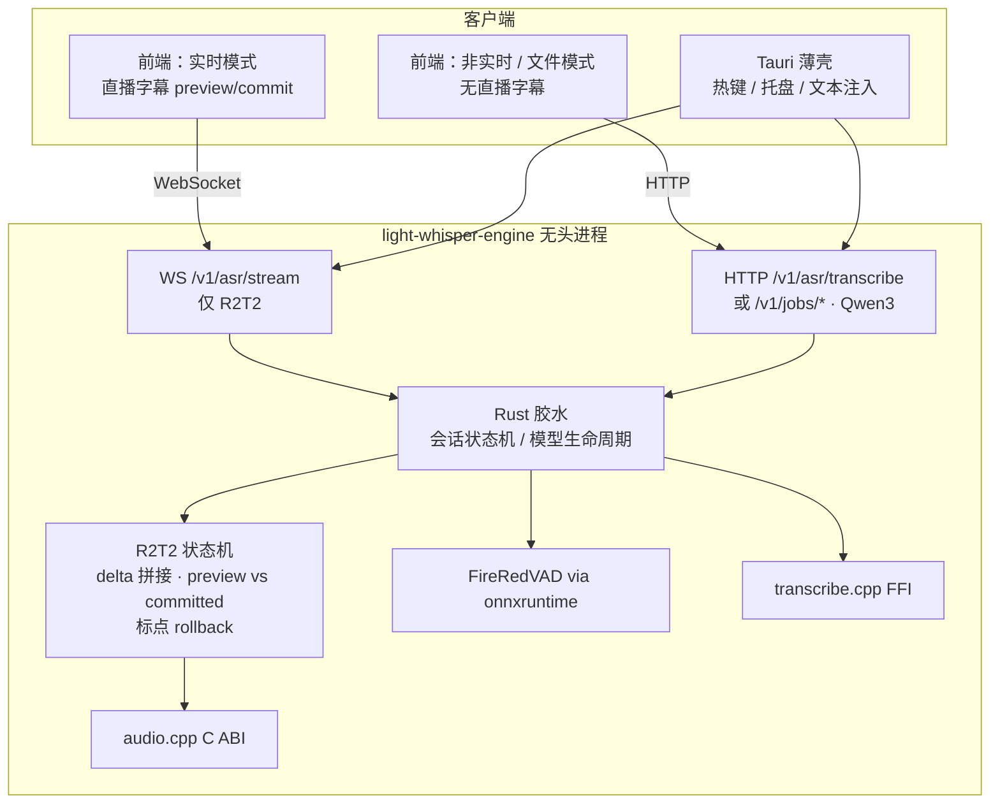

# Command-Cube 规划：前后端拆分（引擎独立）

> 分支：`Command-Cube`  
> 状态：规划文档（本文件仅描述方向，不包含实现）  
> 基于：对 `main` @ `151a61c` 的只读调研  
> **本文主线**：把引擎从 Tauri 一体包拆出、去掉 Python 编排层、本地 HTTP/WS API、薄壳 + 独立前端。

---

## 1. 目标与背景

### 目标（按优先级）

1. **引擎拆出**：本地 ASR 成为可无头运行的独立进程，不再与桌面 UI 捆绑发布。
2. **去掉 Python 编排层**：推理内核已是 C++（`transcribe.cpp`、`audio.cpp` C ABI）；Python 仅做 stdio JSON、FireRedVAD、下载与 GPU 空闲卸载。改为 **Rust 直接调用 C++/ONNX**。
3. **本地服务 API**：引擎对外提供本机 HTTP + WebSocket；**双引擎分工清晰暴露**（见 §3）。
4. **薄 Tauri 壳 + 独立前端**：热键 / 托盘 / 文本注入留在壳内；前端可单独开发，并**按模式分别渲染**（实时字幕 / 无实时字幕）。

### 双引擎产品分工（已定）

| 引擎 | 角色 | 实时字幕 | 说明 |
|------|------|----------|------|
| **Confucius4-R2T2**（audio.cpp） | **实时听写主路径** | **有** | 消费原生 streaming **文本 delta 并拼接**；用小型状态机区分 **provisional（preview）** 与 **committed**，并处理标点回滚/改写（从 `r2t2_native.py` / `r2t2_asr_server.py` 迁出）。**取代**依赖静音切块、遇空白音频易碎的 chunking 方案。 |
| **Qwen3-ASR**（transcribe.cpp） | **回退 / 非实时** | **无** | 整段（utterance）识别；亦供文件类小工具（歌词 / 字幕批处理）使用。 |

两引擎**都保留**，不二选一。前端对两种模式分开展示与交互。

### 背景与分支理由

上游 [`sypsyp97/light-whisper`](https://github.com/sypsyp97/light-whisper) 定位为热键听写客户端，短期内不会做引擎服务化与去 Python。本分支：本地转录链路已重，应复用已有 C++ 内核并拆成可复用服务，而不是推倒换栈。

### 后续功能（非本阶段主线）

- agent 快捷调用：需自行维护接收端插件，细节后续定。
- 歌词 / 视频字幕等文件工具：走 Qwen3 批处理 API + VAD 句级时间；引擎拆分完成后再做。

---

## 2. 现状架构（`main`）

| 层级 | 技术 | 关键路径 |
|------|------|----------|
| 桌面壳 + 前端 | Tauri 2 + React 19 / Vite | `src/`、`src-tauri/tauri.conf.json`、`src/api/tauri.ts` |
| 应用逻辑 | Rust（录音、热键、注入、云 ASR、LLM、历史 SQLite） | `src-tauri/src/services/`、`src-tauri/src/commands/` |
| 本地 ASR 编排 | Python 子进程，stdin/stdout 一行一条 JSON | `src-tauri/src/services/funasr_service.rs`、`funasr_service/protocol.rs`、`resources/server_common.py` |
| Qwen3-ASR 0.6B | Python → `transcribe-cpp`（transcribe.cpp） | `resources/qwen3_asr_server.py`、`scripts/build_engine.py`、`pyproject.toml` |
| Confucius4-R2T2 | Python ctypes → audio.cpp C ABI（已有 preview/commit 流式） | `resources/r2t2_native.py`、`r2t2_asr_server.py`、`r2t2_stream.py`、`scripts/build_r2t2_runtime.py`、`docs/r2t2-native.md` |
| VAD | FireRedVAD ONNX + onnxruntime + kaldi-native-fbank | `resources/firered_vad.py`、随包 `fireredvad_vad.onnx` |
| 发布 | PyInstaller → `engine.exe` → `engine.tar.xz` | `resources/engine.py`、`tauri.conf.json` → `bundle.resources` |

要点：不是 Python 做神经网络推理，而是包着 C++；`funasr_service` 为遗留命名；云端 ASR / 润色已在 Rust。

```text
[React UI] --Tauri invoke/event--> [Rust 宿主]
                                      | stdin/stdout JSON
                                      v
                              [Python engine.exe]
                         transcribe.cpp / audio.cpp + FireRedVAD
```

---

## 3. 目标架构（前后端分离 + 双模式）



原则：

- **R2T2 = 实时 + 直播字幕**：WS 推送 `partial`（provisional）与 `committed`；前端分开展示，已提交文本不回退。
- **Qwen3 = 回退 / 批处理**：整段识别；HTTP 请求/响应或异步 job；**不提供**直播字幕事件。
- 引擎默认绑 `127.0.0.1`；Tauri 保留 OS 特权；独立前端可只连引擎开发。
- Rust 继续做胶水；R2T2 状态机从现有 Python **忠实迁移**，避免再发明 fragile silence-chunking。

---

## 4. 引擎 API 草案（按模式拆分）

基址示例：`http://127.0.0.1:7420`（端口待定），仅本机回环。

### 4.1 共用

| 方法 / 路径 | 说明 |
|-------------|------|
| `GET /health` | 存活、版本、协议版本 |
| `GET /v1/engine/status` | 当前可加载引擎、device、model_loaded、GPU、缺失模型 |
| `GET /v1/models`、`POST /v1/models/{id}/download` | 模型清单与下载 |
| `POST /v1/engine/load` | `{"engine":"confucius4-r2t2"|"qwen3-asr-0.6b", ...}` |
| `POST /v1/engine/unload`、`POST /v1/engine/gpu-idle` | 卸载 / 空闲策略 |

### 4.2 实时模式（R2T2 only）— WebSocket

`WS /v1/asr/stream`（或 `/v1/asr/stream/r2t2`）

- 客户端：`start` / `audio` / `finish` / `cancel`（对齐现有 `protocol.rs` 语义）。
- 服务端：
  - `partial`：`tentative_text`（provisional / preview，可改写）
  - `committed`：已确认前缀（**append-only，不回退**）
  - `result`：会话结束全文
  - `error`
- 服务端内部：拼接 native text deltas + preview/commit 状态机 + 标点 rollback（逻辑源自 `r2t2_native.py` / `r2t2_asr_server.py` / `docs/r2t2-native.md`）。
- **若当前加载的不是 R2T2**：连接拒绝或返回明确错误（勿静默降级到 Qwen3 假装流式）。

### 4.3 非实时 / 批处理（Qwen3）— HTTP

| 方法 / 路径 | 说明 |
|-------------|------|
| `POST /v1/asr/transcribe` | 整段识别；body：path 或 base64；可选 `engine:"qwen3-asr-0.6b"`（默认批处理引擎） |
| `POST /v1/jobs/transcribe`（可选） | 长文件异步任务；轮询或完成回调 |

响应：`text`、`duration`、`language`；可选 `segments[]`（**起止时刻来自 VAD 切段**，非模型原生时间戳，见 §5）。  
**不推送**直播字幕事件。前端非实时 UI 只展示最终（或 job 进度），无 preview 栏。

文件小工具（后期）：歌词 / 字幕调用同一批处理接口；`segments` 供写 LRC/SRT。

---

## 5. 时间戳（已核实）

两引擎**均不原生输出**词级/可靠分段时间戳：

| 组件 | 结论 |
|------|------|
| **Qwen3 / transcribe.cpp** | `TIMESTAMPS_NONE`；词级需后续 **Qwen3-ForcedAligner**（尚未纳入主路径） |
| **R2T2 / audio.cpp** | 流式仅为文本 delta，非 timestamped segments |
| **文件工具** | **句级时间 = VAD 切段边界**；词级对齐器留作后期 |

拆分与实时听写**不依赖**词级时间戳。

---

## 6. 迁移步骤与完成标准

### 步骤 0：契约冻结（双模式）

- 固化 R2T2 流式事件（partial/committed）与 Qwen3 批处理请求/响应；明确「流式端点仅 R2T2」。
- **完成标准**：mock 分别覆盖 WS 流式与 HTTP 批处理；前端可用假数据跑通「有字幕 / 无字幕」两种 UI。

### 步骤 1：VAD 原生化

- onnxruntime + fbank 重写 FireRedVAD（批处理切段与实时侧辅助共用）。
- **完成标准**：与 Python 测例误差可接受；无 Python 可跑 VAD。

### 步骤 2：R2T2 直连（实时主路径，优先）

- Rust FFI → audio.cpp；迁入 delta 拼接与 preview/commit/标点 rollback 状态机；暴露 `WS /v1/asr/stream`。
- **明确废弃** fragile silence/blank chunking 作为实时方案。
- **完成标准**：无 Python 时实时会话通过；committed 文本不回退；直播字幕 UI 可对接；对照 `docs/r2t2-native.md` 与现有 Python 测例。

### 步骤 3：Qwen3 直连（回退 + 批处理）

- Rust FFI → transcribe.cpp；`POST /v1/asr/transcribe`（及可选 job）；去掉 `qwen3_asr_server.py` 服务路径。
- **完成标准**：不启动 Python 即可整段/文件转录；至少一条后端冒烟；前端非实时模式无字幕条亦可完成听写/贴回。

### 步骤 4：拆分发布

- `light-whisper-engine` 无头进程；Tauri 薄壳连本地 API；独立前端双模式联调；剔除 PyInstaller Python 运行时。
- **完成标准**：`engine --serve` + 前端独立开发成功；两种模式 API 文档与错误语义清晰；`formal/` 已更新或显式降级说明。

### 步骤 5：后续（低优先级，非拆分门槛）

- agent 占位能力、LRC/SRT（Qwen3 + VAD segments；可选 ForcedAligner）。

---

## 7. 风险与待定问题

| 风险 / 待定 | 说明 | 缓解 |
|-------------|------|------|
| R2T2 状态机迁移 | preview/commit、标点 rollback、ABI 0.3/0.4、取消语义复杂 | 以现有 Python 为金标准逐条搬；契约 + 回归测例；禁止再用 silence-chunking 冒充实时 |
| 双模式误用 | 前端或调用方把 Qwen3 当流式、或 R2T2 当批处理字幕源 | API 路径分离；错误码明确；UI 模式开关与引擎绑定 |
| 双引擎显存/体积 | 两套原生库与模型并存 | load/unload + gpu-idle；文档说明同时驻留成本 |
| CUDA / CRT 分发 | 去 PyInstaller 后自管依赖 | 复用 `build_r2t2_runtime.py` / `build_engine.py` manifest |
| 脱离 Tauri 丢系统能力 | 纯 Web 无热键/托盘/注入 | 保留薄壳 |
| `formal/` 同步 | 原 IPC 假设变化 | 按双模式更新或 COVERAGE 暂缓标注 |
| Rust 工具链 | 依赖需 rustc ≥1.87/1.88 | 钉住 **≥ 1.88** |
| 本机端口安全 | 误暴露局域网 | 默认 `127.0.0.1`；可选 token |
| 文件时间戳精度 | 仅 VAD 句级 | 产品提示；词级 Align 后期 |

---

## 8. 非目标（本阶段）

- 设计 agent 接收端插件协议或内置 Agent 运行时。
- 实现歌词 / 字幕完整产品流水线。
- 用 Qwen3 伪流式（切块）替代 R2T2 实时路径。
- 重写为 Electron / 纯 C++ GUI；强制全面换成 whisper.cpp。
- 变更 GPL-3.0-only。

---

## 9. 参考路径速查

```text
docs/command-cube/PLAN.md          ← 本文件
docs/r2t2-native.md                ← R2T2 流式 / commit 语义
docs/development.md
src-tauri/src/services/funasr_service.rs
src-tauri/src/services/funasr_service/protocol.rs
src-tauri/resources/r2t2_native.py
src-tauri/resources/r2t2_asr_server.py
src-tauri/resources/r2t2_stream.py
src-tauri/resources/qwen3_asr_server.py
src-tauri/resources/firered_vad.py
src-tauri/resources/server_common.py
scripts/build_engine.py
scripts/build_r2t2_runtime.py
src/api/tauri.ts
```
