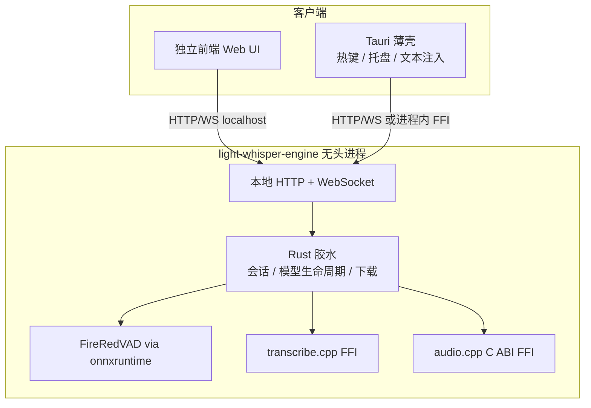

# Command-Cube 规划：前后端拆分（引擎独立）

> 分支：`Command-Cube`  
> 状态：规划文档（本文件仅描述方向，不包含实现）  
> 基于：对 `main` @ `151a61c` 的只读调研  
> **本文主线**：把引擎从 Tauri 一体包拆出、去掉 Python 编排层、本地 HTTP/WS API、薄壳 + 独立前端。

---

## 1. 目标与背景

### 目标（按优先级）

1. **引擎拆出**：本地 ASR 成为可无头运行的独立进程，不再与桌面 UI 捆绑发布。
2. **去掉 Python 编排层**：推理内核已是 C++（`transcribe.cpp`、`audio.cpp` C ABI）；Python 仅做 stdio JSON、FireRedVAD、下载与 GPU 空闲卸载。改为 **Rust 直接调用 C++/ONNX**。
3. **本地服务 API**：引擎对外提供本机 HTTP + WebSocket（流式听写用 WS）。
4. **薄 Tauri 壳 + 独立前端**：热键 / 托盘 / 文本注入留在壳内；前端可单独开发、连本地引擎。

### 背景与分支理由

上游 [`sypsyp97/light-whisper`](https://github.com/sypsyp97/light-whisper) 定位为热键听写客户端，功能边界清晰，短期内不会做引擎服务化与去 Python。

本分支理由：本地转录链路（模型、流式会话、VAD、CUDA 分发、IPC）已经很重；继续堆在单一一体包里不利于复用。推理内核已是原生库，**应复用并直连**，而不是推倒换成另一套模型栈（除非明确放弃 Qwen3-ASR / R2T2）。引擎服务化后，同一套识别能力可服务桌面壳与独立 Web UI。

### 后续功能（非本阶段主线）

- agent 快捷调用：需自行维护接收端插件，细节后续定。
- 歌词（音频 → LRC）、视频字幕（ffmpeg 抽轨 → SRT/VTT）：引擎 API 稳定后再做；时间戳与伴奏限制见 §5。

---

## 2. 现状架构（`main`）

| 层级 | 技术 | 关键路径 |
|------|------|----------|
| 桌面壳 + 前端 | Tauri 2 + React 19 / Vite | `src/`、`src-tauri/tauri.conf.json`、`src/api/tauri.ts` |
| 应用逻辑 | Rust（录音、热键、注入、云 ASR、LLM、历史 SQLite） | `src-tauri/src/services/`、`src-tauri/src/commands/` |
| 本地 ASR 编排 | Python 子进程，stdin/stdout 一行一条 JSON | `src-tauri/src/services/funasr_service.rs`、`funasr_service/protocol.rs`、`resources/server_common.py` |
| Qwen3-ASR 0.6B | Python → `transcribe-cpp`（transcribe.cpp） | `resources/qwen3_asr_server.py`、`scripts/build_engine.py`、`pyproject.toml` |
| Confucius4-R2T2 | Python ctypes → audio.cpp C ABI | `resources/r2t2_native.py`、`r2t2_asr_server.py`、`scripts/build_r2t2_runtime.py`、`docs/r2t2-native.md` |
| VAD | FireRedVAD ONNX + onnxruntime + kaldi-native-fbank | `resources/firered_vad.py`、随包 `fireredvad_vad.onnx` |
| 发布 | PyInstaller → `engine.exe` → `engine.tar.xz` | `resources/engine.py`、`tauri.conf.json` → `bundle.resources` |

要点：

- **不是 Python 在做神经网络推理**，而是 Python 包着已编译的 C++ 库。
- `funasr_service` 为遗留命名；当前本地引擎是 Qwen3-ASR / R2T2。
- 云端 ASR、AI 润色等已在 Rust，与 Python 无关。

```text
[React UI] --Tauri invoke/event--> [Rust 宿主]
                                      |
                                      | stdin/stdout JSON
                                      v
                              [Python engine.exe]
                         transcribe.cpp / audio.cpp + FireRedVAD
```

---

## 3. 目标架构（前后端分离）



原则：

- 引擎默认绑 `127.0.0.1`；流式走 WS，请求/响应走 HTTP。
- Tauri 只保留 OS 特权；UI 可内嵌或打开外部前端。
- 独立前端用 Vite 单独 `dev`，直连引擎，不再强制 `invoke`。
- **Rust 继续做胶水**（录音、历史、下载等已在 Rust）。
- 过渡：先保持与现有 `protocol.rs` 相近的 JSON 语义，再演进 REST/WS 资源模型。

---

## 4. 引擎 API 草案（拆分边界）

基址示例：`http://127.0.0.1:7420`（端口待定），仅本机回环。

| 类别 | 方法 / 路径 | 说明 |
|------|-------------|------|
| 健康 | `GET /health` | 存活、版本、协议版本 |
| 状态 | `GET /v1/engine/status` | 引擎、device、model_loaded、GPU、缺失模型（对齐现 `FunASRStatus`） |
| 模型 | `GET /v1/models`、`POST /v1/models/{id}/download`、`POST /v1/engine/load\|unload`、`POST /v1/engine/gpu-idle` | 清单、下载、加载/卸载、空闲策略 |
| 流式听写 | `WS /v1/asr/stream` | 对齐现有 `stream_start` / `feed` / `finish` / `cancel`（见 `protocol.rs`） |
| 文件转录 | `POST /v1/asr/transcribe` | path 或 base64；返回 `text` / `duration`；可选 `segments`（见 §5） |

流式消息类型草案：`start` / `audio` / `finish` / `cancel` → `partial` / `committed` / `result` / `error`。

---

## 5. 时间戳核实（影响后续歌词/字幕；拆分本身不阻塞）

| 组件 | 词级 | 分段时间戳 | 结论 |
|------|------|------------|------|
| **transcribe.cpp / Qwen3-ASR** | 否 | 否（`TIMESTAMPS_NONE`） | 官方 family 文档写明无 segment/word timestamps；词级需 sibling **Qwen3-ForcedAligner**（尚未纳入 transcribe.cpp 主路径）。见 [qwen3_asr.md](https://github.com/handy-computer/transcribe.cpp/blob/main/docs/porting/families/qwen3_asr.md) |
| **audio.cpp / R2T2** | 未文档化支持 | 流式为文本 delta，非 timestamped segments | HF：*Streaming deltas contain transcript text only*；CLI `--words-out` 不能默认用于 R2T2 |
| **本仓库现状** | 无 | VAD 切段送识别，不向 UI 暴露时间轴 | `TranscriptionResult` 主要是 `text` + `duration` |

后续 LRC/SRT 可先用 VAD 句级近似；歌曲伴奏可能需人声分离——均属后期产品项。

---

## 6. 迁移步骤与完成标准

### 步骤 0：契约冻结

- 固化现有 stdio JSON schema（`ServerCommand` / `ServerResponse`）为契约文档或 OpenAPI 初稿，并加 mock 测试。
- **完成标准**：Rust mock 引擎跑通 start/feed/finish/cancel/transcribe/status，行为对齐当前 Python 黄金样例。

### 步骤 1：VAD 原生化

- onnxruntime（C++ 或 Rust `ort`）+ fbank 重写 FireRedVAD，替换 `firered_vad.py`。
- **完成标准**：同测例与 Python 实现误差可接受；无 Python 可单独跑 VAD。

### 步骤 2：Qwen3 直连

- Rust FFI 加载 transcribe.cpp；去掉 `qwen3_asr_server.py` 服务路径。
- **完成标准**：不启动 Python 即可 Qwen3 文件转录；至少一条后端（CUDA/Vulkan/CPU）冒烟通过。

### 步骤 3：R2T2 直连

- 将 `r2t2_native.py` 迁到 Rust FFI；保留 rolling、commit/preview、finish 静音尾等语义（`docs/r2t2-native.md`）。
- **完成标准**：无 Python 时流式集成测试通过；字幕 commit 不回退属性保持。

### 步骤 4：拆分发布（本规划的核心交付）

- 抽出 `light-whisper-engine`；HTTP/WS；Tauri 连本地引擎；独立前端可只连引擎开发；剔除 PyInstaller Python 运行时。
- **完成标准**：`engine --serve` 无头启动 + 前端独立联调成功；安装包不再捆绑 `engine.tar.xz` 内 Python 运行时；`formal/` 引擎相关契约已更新或显式降级说明。

### 步骤 5：后续功能（低优先级）

- agent 入口插件、LRC、视频字幕等在 API 稳定后另开任务；**不作为拆分完成的门槛**。

---

## 7. 风险与待定问题

| 风险 / 待定 | 说明 | 缓解 |
|-------------|------|------|
| R2T2 流式逻辑 | preview/commit、ABI 差异、取消语义在 Python | 契约测试；对照 `docs/r2t2-native.md` 与现有测例迁移 |
| CUDA / CRT 分发 | 去 PyInstaller 后需自管原生依赖清单 | 复用 `build_r2t2_runtime.py` / `build_engine.py` 的 manifest 思路 |
| 脱离 Tauri 丢系统能力 | 纯 Web 无全局热键/托盘/可靠注入 | 保留薄壳；独立前端定位开发/批处理控制台 |
| `formal/` 同步 | TLA+ 依赖当前 IPC / UI 生命周期 | 逐步更新或在 COVERAGE 标注暂缓 |
| Rust 工具链 | 调研机 `rustc 1.85.1` 无法 check（依赖要 ≥1.87/1.88） | 钉住 **rustc ≥ 1.88**（或 `rust-toolchain.toml`） |
| 本机端口安全 | HTTP 误暴露局域网 | 默认 `127.0.0.1`；可选 token |
| 上游回合 | 引擎边界大改，合并上游成本高 | 接受 fork 演进；保持听写产品行为兼容以便 cherry-pick |

---

## 8. 非目标（本阶段）

- 设计 agent 接收端插件协议或内置 Agent 运行时。
- 实现歌词 / 字幕产品流水线。
- 重写为 Electron / 纯 C++ GUI。
- 强制全面换成 whisper.cpp（可作可选后端，非迁移前提）。
- 变更 GPL-3.0-only（第三方许可证仍各自适用）。

---

## 9. 参考路径速查

```text
docs/command-cube/PLAN.md          ← 本文件
docs/r2t2-native.md
docs/development.md
src-tauri/src/services/funasr_service.rs
src-tauri/src/services/funasr_service/protocol.rs
src-tauri/resources/qwen3_asr_server.py
src-tauri/resources/r2t2_asr_server.py
src-tauri/resources/r2t2_native.py
src-tauri/resources/firered_vad.py
src-tauri/resources/server_common.py
scripts/build_engine.py
scripts/build_r2t2_runtime.py
src/api/tauri.ts
```
